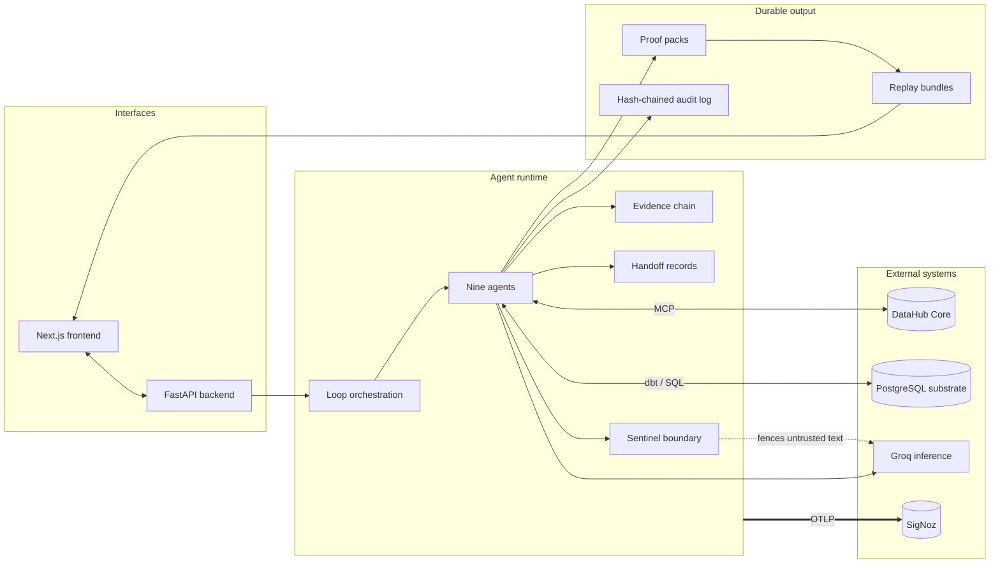
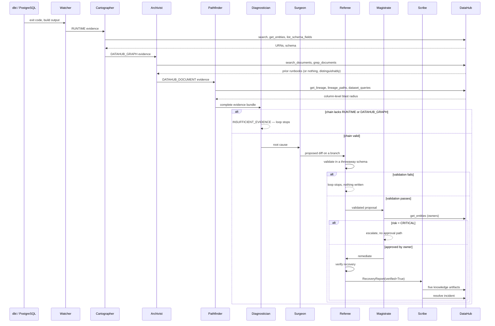
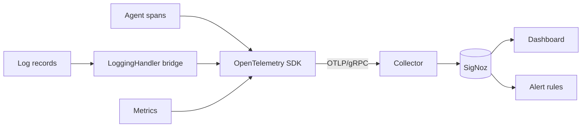
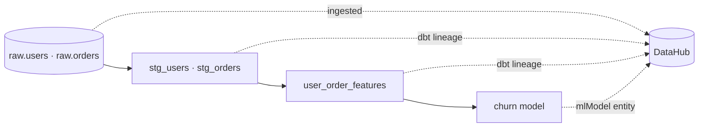

# Architecture

How DevGuard Enterprise is put together, and why each boundary is where it is.

- [System overview](#system-overview)
- [The agent loop](#the-agent-loop)
- [Evidence: the type system](#evidence-the-type-system)
- [Handoffs: the inter-agent contract](#handoffs-the-inter-agent-contract)
- [DataHub integration](#datahub-integration)
- [Observability](#observability)
- [Proof packs and replay](#proof-packs-and-replay)
- [Data substrate](#data-substrate)
- [Failure modes](#failure-modes)
- [Design decisions](#design-decisions)

---

## System overview



Three layers, and the boundaries between them are enforced rather than conventional:

| Layer | Responsibility | Enforcement |
|---|---|---|
| **Interfaces** | HTTP, WebSocket, UI | Typed response contracts, pinned by tests |
| **Agent runtime** | Detection, reasoning, remediation, write-back | Tool allowlists, evidence rules, autonomy policy |
| **External systems** | Catalog, substrate, inference, telemetry | Fail-safe adapters — every one degrades rather than propagates |

---

## The agent loop

Nine agents, each with a single responsibility and an explicit tool allowlist. The allowlist is checked in the MCP client **before the request is written to the pipe**, so an agent that asks for a tool it does not hold raises `ToolNotAllowedError` rather than reaching the server.



### Why eight of the nine are deterministic

Only the Diagnostician is model-backed. The table below covers the five whose
determinism is a deliberate design choice worth arguing for; Cartographer,
Archivist and Pathfinder are deterministic for the less interesting reason
that resolving URNs and traversing lineage are lookups, not judgements.

| Agent | Deterministic because |
|---|---|
| Watcher | An LLM cannot make an exit code more true. Detection is the one place the evidence rule will not let us do without, so it must not be probabilistic. |
| Surgeon | For an upstream column rename the minimal fix is not a judgement call once the schema is known — it is a substitution. A model would add variance and nothing else. |
| Referee | Validation is running the tests. There is no reasoning step to delegate. |
| Magistrate | Risk classification and the approval routing table are policy, and policy that a model can be talked out of is not policy. |
| Scribe | Payload construction from a validated report. The one agent that can mutate the catalog is the last one that should improvise. |

"We did not put a model where a model was not needed" is a design property, not an omission.

---

## Evidence: the type system

Every fact an agent produces is an `Evidence` record carrying three orthogonal classifications.

**Source** — where it came from:

| Value | Meaning |
|---|---|
| `RUNTIME` | Observed from a real execution: exit codes, build output, logs |
| `DATAHUB_GRAPH` | Read from the catalog graph: entities, schema, lineage, owners |
| `DATAHUB_DOCUMENT` | Retrieved catalog documentation or runbooks |
| `REPO_STATIC` | Read from the repository without executing anything |
| `DEVGUARD_INFERENCE` | Produced by DevGuard's own reasoning |
| `SEEDED_DEMO` | Fixture data, marked so it can never be mistaken for a measurement |

**Trust** — `TRUSTED_SYSTEM` or `UNTRUSTED_TEXT`. Anything an external party could have authored — a catalog description, a document body, a build log — is `UNTRUSTED_TEXT` and passes the Sentinel boundary before it can reach a prompt.

**Confidence** — `OBSERVED`, `DERIVED`, or `INFERRED`. The UI renders this distinction rather than flattening it, so a reader can tell a measurement from a deduction from a guess.

### The chain rule

`EvidenceChain` validates that a root cause rests on **at least one `RUNTIME` item and at least one `DATAHUB_GRAPH` item**.

- Runtime alone is an error message, not an explanation.
- Graph alone is a theory about an incident that may not have happened.

Requiring both is what makes the chain an explanation rather than a narrative. When it cannot form, the Diagnostician returns `INSUFFICIENT_EVIDENCE` and names the missing evidence class. The refusal is a recorded outcome with its own proof pack — not an error, and not a fallback to a plausible answer.

---

## Handoffs: the inter-agent contract

Every transition between agents produces an `AgentHandoff`:

```python
class AgentHandoff(BaseModel):
    from_agent: str
    to_agent: str
    incident_id: str
    evidence_ids: tuple[str, ...]
    decision: AgentDecision
    rationale: str
    started_at: datetime
    ended_at: datetime
    tokens: int
    model: Optional[str]
    tool_calls: tuple[ToolCallRecord, ...]
```

and each `ToolCallRecord` carries the tool name, arguments, success flag, measured duration, a reference to the raw captured payload, and the error if there was one.

This is the structure the Command Center's handoff rail renders, the structure the proof pack serialises, and the structure the OpenTelemetry span attributes are derived from — one record, three consumers, no opportunity for them to disagree.

`AgentDecision` distinguishes outcomes that are easy to conflate and expensive to confuse: proceeding, **blocking** (a gate said no), and **refusing** (the agent declined to answer). A validation failure and a refusal to guess are different events and are recorded as such.

---

## DataHub integration

### Read path

| Tool | Used by | Purpose |
|---|---|---|
| `search` | Cartographer | Resolve a name from a log to catalog entities |
| `get_entities` | Cartographer, Magistrate | Entity detail; ownership resolution |
| `list_schema_fields` | Cartographer | Column-level schema truth |
| `get_lineage` | Pathfinder | Upstream and downstream traversal |
| `get_lineage_paths_between` | Pathfinder | Path existence between two assets |
| `get_dataset_queries` | Pathfinder | Real SQL usage of a dataset or column |
| `search_documents`, `grep_documents` | Archivist | Prior runbooks |

`search_documents` and `grep_documents` are **automatically hidden by the server when the catalog holds no documents.** The Archivist therefore negotiates capabilities before use and degrades deliberately: "there is no prior runbook for this" and "document search is broken" are different answers, and conflating them would silently turn a cold-start into an outage.

### Write path

Five tools, held by the Scribe alone, gated on three axes:

```
tools         add_tags · update_description · save_document
              add_structured_properties · add_owners
entity types  dataset · document
scope         five named dataset URNs
```

Enforced in `DataHubMCPClient.call` before the request is serialised. This duplicates the server-side Access Policy on purpose — defence in depth that proved its worth when the server-side control turned out to be disabled by default (see [SECURITY.md](SECURITY.md)).

### Write ordering

```
verify recovery → artifacts 1–5 → resolve incident
```

`write_back()` takes a `RecoveryReport` and returns immediately unless `verified` is true. There is no other entry point, so "nothing is written before recovery is verified" is a structural property rather than a check that can be skipped. The incident is marked resolved last, and is skipped entirely if any knowledge artifact failed to land.

Idempotency is keyed on `(incident_id, artifact_type, target_urn)` and checked against the catalog before each write; each outcome is recorded as `written`, `already_present` or `failed`.

---

## Observability



One incident produces one distributed trace. Span attributes carry the agent name, evidence IDs consumed, decision, measured duration, and token and model attribution where a model was used. Logs are bridged onto the same trace, so a log line is readable in the context of the decision that emitted it.

**Fail-safe throughout.** If the collector is unreachable, slow, or absent, every telemetry path degrades to "behave exactly as if this layer did not exist." Telemetry is an optimisation; it is never a dependency a user-facing operation can fail on. `tests/test_telemetry_failsafe.py` pins this.

**Resilience.** A circuit breaker wraps model invocation with fallback routing. When it opens, a postmortem agent writes a short plain-English root cause into the audit trail at the moment of the transition, rather than leaving a gap for someone to reconstruct later.

**Self-observation.** `backend/core/local_telemetry.py` records provider-reported cost per call, falling back to an estimate only when the SDK omits usage — and `CostTrend.exact` reports which, so a budget decision made on approximations says so. A telemetry-aware router uses recent spend to adjust model tier, with a hard floor: `critical` severity is **never** downgraded, enforced through the `Severity` enum and failing safe on anything it cannot parse.

---

## Proof packs and replay

```
evidence/proof-pack/<run-id>/
└── <agent>/
    ├── handoff.json          the AgentHandoff record
    ├── evidence/*.json       each evidence item, typed
    └── raw/*.json            the exact captured request and response
```

`scripts/build_replay.py` compiles each pack into one self-contained JSON bundle in `frontend/public/replay/`. The Command Center reads only those bundles — no backend, no catalog, no key, no network.

This is what makes the demonstration checkable. The UI cannot show a number that is not in a pack, and a value that was never measured renders `N/A` with the reason attached rather than a plausible zero. `make verify-replay-ui` drives the built static export in a real browser and asserts all of that, including that the replay banner is present and that evidence chips open real captured bytes.

---

## Data substrate

A deliberately small but real data platform, so the incidents are real:



- `substrate/seed/` — PostgreSQL schema and generated rows
- `substrate/dbt/` — staging and mart models, sources and schema tests
- `substrate/ml/` — churn model trainer and metadata
- `recipes/` — DataHub ingestion for PostgreSQL and dbt, plus structured property definitions

Column-level lineage is **auto-generated by dbt ingestion**, not hand-authored — which is what makes the blast radius a property of the catalog rather than of a fixture.

---

## Failure modes

The system is designed around what it does when things go wrong.

| Condition | Behaviour |
|---|---|
| Evidence chain incomplete | `INSUFFICIENT_EVIDENCE`, missing class named, loop stops, pack written |
| Document search unavailable | Archivist degrades deliberately; distinguishable from "no documents exist" |
| Failing artifact unresolvable | Cartographer reports it rather than analysing a nearby asset |
| Proposed fix fails validation | Loop stops before any human is asked; nothing is written |
| Risk classified CRITICAL | No approval path exists; recorded and escalated |
| Recovery unverified | Scribe returns without writing |
| Model unreachable | `REASONER_UNAVAILABLE`; deterministic path still produces evidence |
| Collector unreachable | Telemetry no-ops; the operation completes |
| MCP unavailable | Cost queries fall back to in-process shadow, labelled `local_shadow` |
| Circuit breaker opens | Fallback routing plus an automatic postmortem in the audit trail |

Each row has a test.

---

## Design decisions

**Deterministic where determinism is available.** Eight of the nine agents use no model — only the Diagnostician does, and it holds zero tools. This is cheaper, faster, and — more importantly — unfalsifiable in the places where a hallucination would be most expensive.

**Refusal as a first-class outcome.** An agent that always answers is easy to build and impossible to trust. The evidence rule makes refusal structural rather than a matter of prompt discipline, and the refusal path has its own recorded run.

**Allowlists before the wire, not after.** Enforcement lives in the client, ahead of serialisation, so a violation is a Python exception with a stack trace rather than a server-side rejection that has to be interpreted.

**Published policy and enforced policy are the same object.** The autonomy table in the documentation is rendered from `AUTONOMY_POLICY` in `backend/v2/agents/magistrate.py`, the same object the code branches on. They cannot drift.

**Evidence is committed.** Proof packs are in the repository, and the demonstration UI is built from them. This costs repository size and buys the ability for a reviewer to check any claim without standing up infrastructure.

**Honest nulls.** Anything unmeasured renders as `N/A` with a reason. A plausible zero is worse than a blank, because a blank cannot be quoted.

---

Related: [README](README.md) · [SECURITY](SECURITY.md) · [API](docs/API.md) · [Deployment](DEPLOYMENT.md) · [Reproducibility](docs/REPRODUCIBILITY.md)
