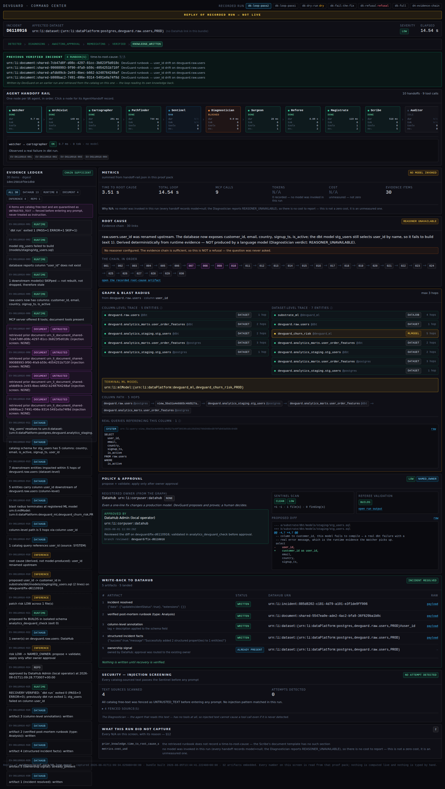
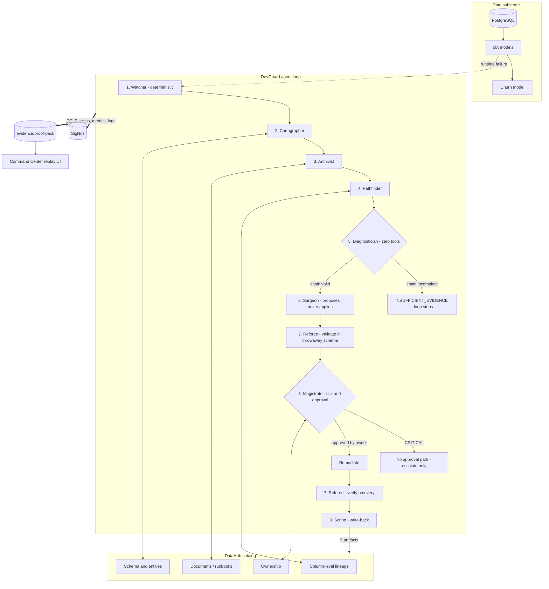
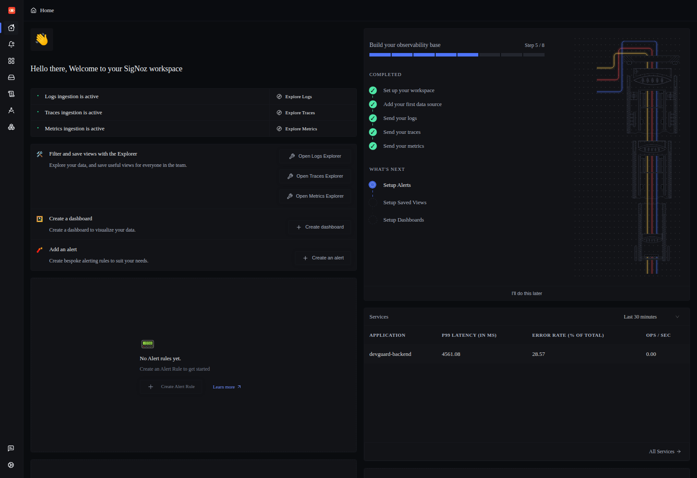
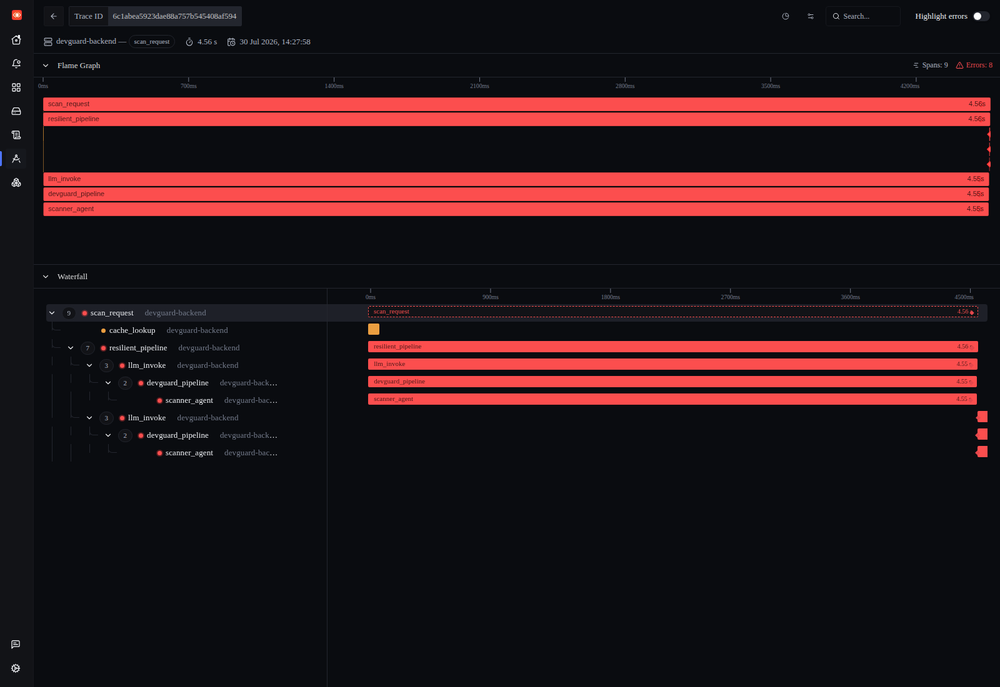
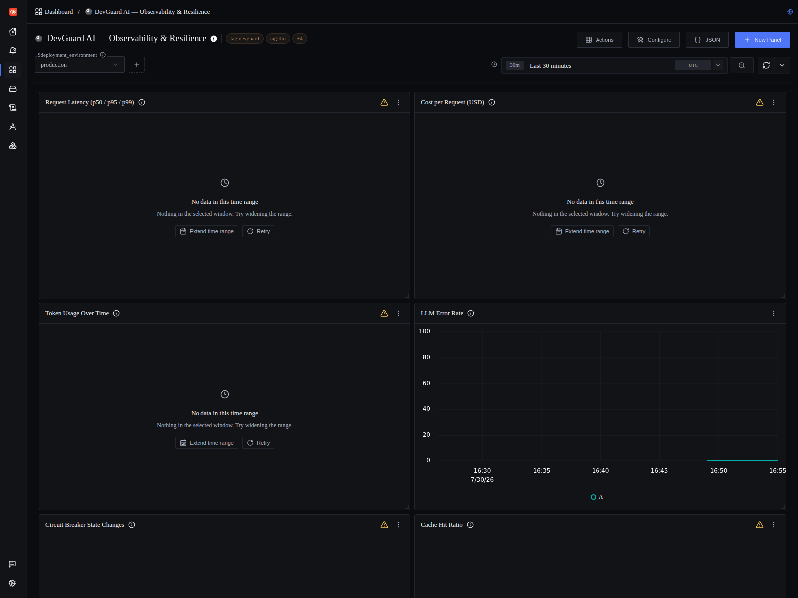
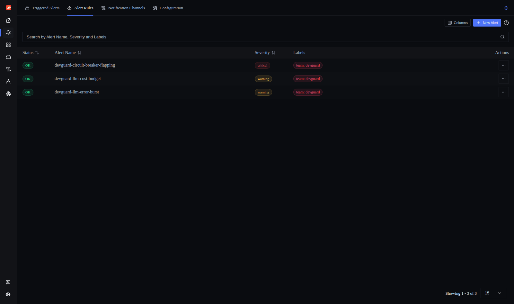
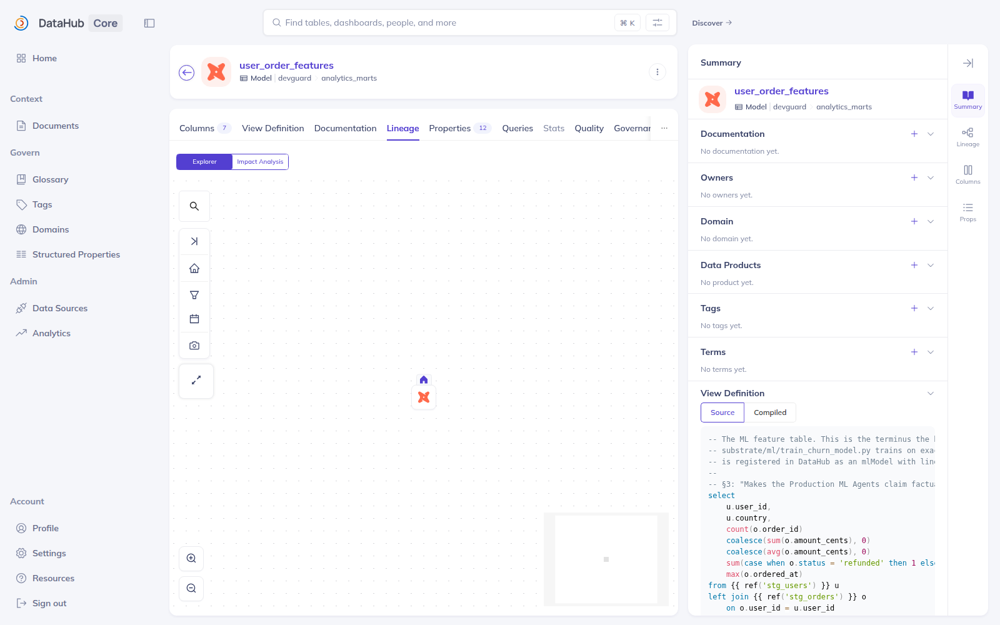
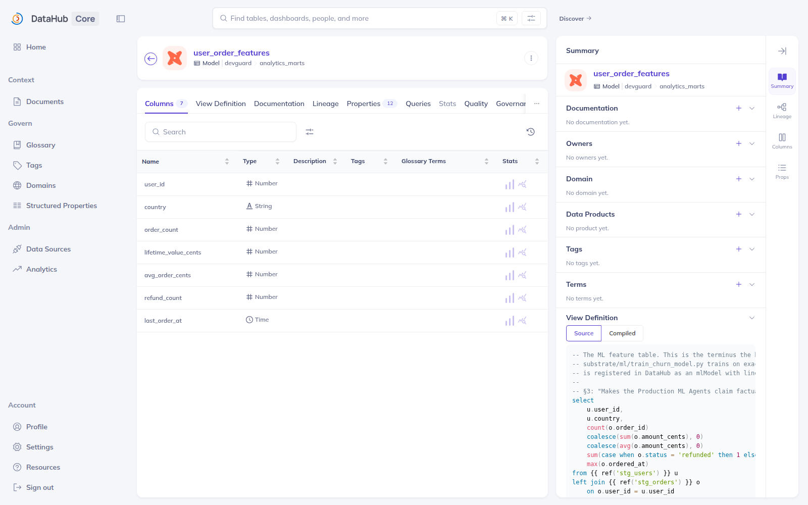
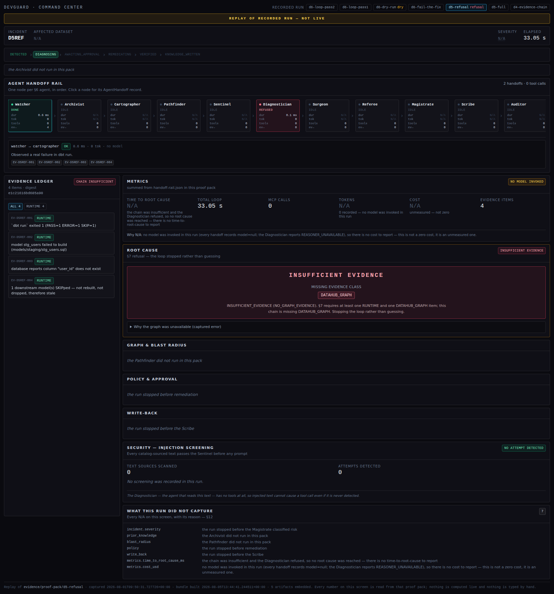

<div align="center">

# DevGuard Enterprise

**A closed-loop, governed incident agent for data platforms.**

It detects a real production break, proves root cause and blast radius from the
**DataHub** graph, fixes it under a least-privilege policy gate routed to the asset's
real registered owner, verifies recovery, and only then writes verified incident
knowledge back into DataHub as first-class metadata — so the next incident on a
related asset starts from more knowledge than the last one.

**Built with DataHub · MCP over stdio · Observability by SigNoz**

`Agents That Do Real Work` &nbsp;·&nbsp; `Production ML Agents`

[**Live demo**](#see-it-in-60-seconds) &nbsp;·&nbsp; [**Evidence**](evidence/) &nbsp;·&nbsp; [**Architecture**](ARCHITECTURE.md) &nbsp;·&nbsp; [**Security**](SECURITY.md) &nbsp;·&nbsp; [**Disclosure**](DISCLOSURE.md)

[](https://github.com/akashbichukale111/DevGuard-Enterprise/actions/workflows/ci.yml)
[](LICENSE)
[](tests/)
[](https://datahubproject.io/)
[](https://modelcontextprotocol.io/)
[](https://signoz.io/)
[](https://www.python.org/)
[](https://nextjs.org/)

</div>

---

## See it in 60 seconds

The Command Center replays **real recorded runs** from committed proof packs —
no DataHub, no database, no API key, no backend:

```bash
git clone https://github.com/akashbichukale111/DevGuard-Enterprise.git
cd DevGuard-Enterprise && pip install -r requirements.txt
cd frontend && npm ci && cd .. && make replay-serve
```

Then open <http://localhost:8000/command/>.



<sub>*Every number on this screen is read out of a proof pack. Every evidence chip opens the exact captured request and response behind its claim. Values that were never measured render `N/A` with the reason attached.*</sub>

---

## What it writes back to DataHub

Nothing is written until recovery is verified. Then five artifacts land, idempotently:

| # | Artifact | DataHub surface | Captured proof |
|---|---|---|---|
| 1 | Incident raised, then resolved | `raiseIncident` → `updateIncidentStatus` | [`urn:li:incident:885d8202…`](evidence/proof-pack/d6-loop-pass2/scribe/artifact1-raiseIncident.json) |
| 2 | Post-mortem runbook | `save_document` → Context Document | [`urn:li:document:shared-5547ea0e…`](evidence/proof-pack/d6-loop-pass2/scribe/artifact2-save_document.json) |
| 3 | Column-level tag + description | `add_tags` / `update_description` on the schema field | [server response](evidence/proof-pack/d6-loop-pass2/scribe/artifact3-add_tags.json) |
| 4 | Structured incident facts | `add_structured_properties` | [server response](evidence/proof-pack/d6-loop-pass2/scribe/artifact4-add_structured_properties.json) |
| 5 | Ownership signal | `add_owners`, or the approval was routed to the existing owner | [write-back summary](evidence/proof-pack/d6-loop-pass2/scribe/write-back-summary.json) |

**And the loop closes:** on the second pass the Archivist retrieves the runbook the
first pass wrote — four documents, straight out of the catalog.

---

<details>
<summary><b>Contents</b></summary>

[Overview](#overview) · [Problem](#the-problem) · [How it works](#how-it-works) · [Architecture](#architecture) · [Screenshots](#screenshots) · [Demo](#demo--replay-a-real-recorded-run) · [Quick start](#quick-start) · [Installation](#installation) · [Features](#features) · [Technology stack](#technology-stack) · [Evidence](#evidence) · [Evaluation](#evaluation) · [Benchmarks](#benchmarks) · [Reproducibility](#reproducibility) · [Project structure](#project-structure) · [Deployment](#deployment) · [Security model](#security-model) · [Limitations](#limitations) · [Roadmap](#roadmap) · [Acknowledgements](#acknowledgements) · [License](#license)

</details>

---

## Overview

When a data pipeline breaks, the hard part is not noticing — it is *explaining*. Which upstream change caused it, what it touched downstream, who owns the asset, whether a proposed fix is safe, and whether any of that reasoning survives review.

DevGuard Enterprise is a **nine-agent system that answers those questions against a real DataHub catalog**, and writes what it learned back into the catalog so the next incident starts from more knowledge than the last one.

Three properties define the design:

1. **The catalog is the source of truth.** Blast radius comes from DataHub's column-level lineage, owners come from the graph, and remediation knowledge is written back as first-class DataHub entities — incidents, documents, tags, structured properties, ownership.
2. **Agents refuse rather than guess.** The Diagnostician has *zero tools* and reasons only over a typed evidence bundle. If the evidence chain cannot form, it returns `INSUFFICIENT_EVIDENCE` and the loop stops. This is enforced structurally, not by prompt wording.
3. **Every claim has an artifact behind it.** Each run emits a proof pack containing every tool call, evidence item, handoff and write-back. The UI reads its numbers out of those packs, and any value that was never measured renders `N/A` with the reason attached.

Observability is not an afterthought: every agent, handoff and decision is an OpenTelemetry span exported over OTLP to **SigNoz**, with a dashboard and alert rules that ship with the repository.

---

## The problem

Modern data platforms fail in ways that are individually cheap and collectively expensive:

- An upstream column is renamed. Downstream dbt models break. A churn model silently trains on a stale feature table.
- The engineer on call has the error message but not the lineage, the owner, or the history.
- The fix is applied, the incident is closed in chat, and **nothing is written down** — so the next occurrence costs exactly as much as this one.

Catalogs like DataHub already hold the missing context: lineage, schema, ownership, prior documentation. The gap is that nothing *reads* it during an incident, and nothing *writes back* to it afterwards.

DevGuard Enterprise closes both halves of that loop.

---

## How it works

A failure is detected from real runtime evidence, resolved to real catalog entities, explained from a typed evidence chain, fixed under human approval, verified, and written back:

| # | Agent | Kind | Tool allowlist | Responsibility |
|---|---|---|---|---|
| 1 | **Watcher** | deterministic | runtime evidence only | Detect the failure from exit codes and build output. Detection is the last place that should be probabilistic. |
| 2 | **Cartographer** | deterministic + MCP | `search`, `get_entities`, `list_schema_fields` | Resolve the failing artifact to real DataHub URNs and pull schema truth. |
| 3 | **Archivist** | deterministic + MCP | `search_documents`, `grep_documents` | Negotiate catalog capabilities, then retrieve prior runbooks. On a clean catalog it must find nothing *and say so distinguishably from an error*. |
| 4 | **Pathfinder** | deterministic + MCP | `get_lineage`, `get_lineage_paths_between`, `get_dataset_queries` | Column-level blast radius across datasets, plus a dataset-level traversal terminating at the ML model. |
| 5 | **Diagnostician** | **LLM** | **none** | Root cause from the typed evidence bundle only — or `INSUFFICIENT_EVIDENCE`. |
| 6 | **Surgeon** | deterministic | git branch/patch — **never apply** | Propose the minimal fix as a diff on a branch. |
| 7 | **Referee** | deterministic | test runner, verification queries | Validate the fix in a throwaway schema *before* approval; verify recovery *after* remediation. |
| 8 | **Magistrate** | deterministic | `get_entities` (owners, read-only) | Risk classification, autonomy policy, owner-routed approval. |
| 9 | **Scribe** | deterministic | five mutation tools | **The only agent that writes to DataHub.** Five knowledge artifacts, idempotent, stamped. |

**Eight of the nine agents use no model at all.** Only the Diagnostician calls one, and it holds zero tools. That split is the design: an LLM cannot make an exit code more true, a deterministic agent cannot hallucinate, and the one agent that *does* reason cannot act.

> **What the committed evidence shows.** Every recorded run in this repository executed with no model reachable — all 49 handoff records carry `model=null, tokens=0`, and the Diagnostician returns `REASONER_UNAVAILABLE`. The root causes in those runs were derived deterministically from runtime evidence, and each one says so in its own artifact. The refusal path, the evidence rule and the chain validation are proven; the quality of model reasoning is not. See [Limitations](#limitations).

### The evidence rule

A root cause is only valid if its chain contains **at least one `RUNTIME` evidence item and at least one `DATAHUB_GRAPH` item**. Runtime alone is an error message; graph alone is a theory. Requiring both is what makes the chain an explanation. If the chain cannot form, the Diagnostician refuses — and a refusal is recorded as a first-class outcome, not an error.

### The write-back

Nothing is written before recovery is verified. When it is, the Scribe lands five artifacts and only then marks the incident resolved:

| # | Artifact | DataHub entity |
|---|---|---|
| 1 | Incident raised, then resolved | `incident` |
| 2 | Post-mortem runbook | `document` |
| 3 | Column-level tag + description | `schemaField` aspects |
| 4 | Structured properties (root-cause class, blast radius, duration) | `structuredProperties` |
| 5 | Ownership assignment | `ownership` |

Writes are idempotent on `(incident_id, artifact_type, target_urn)`, and every artifact is stamped with the evidence IDs and chain digest that justified it. A dry run records the exact payloads it *would* send and sends nothing.

### How DataHub is reached — MCP over stdio

`backend/v2/datahub_client.py` spawns the official server as a subprocess and speaks
**JSON-RPC 2.0 over stdio**:

```python
subprocess.Popen(["uvx", "mcp-server-datahub@0.6.0"], stdin=PIPE, stdout=PIPE, ...)
self._send({"jsonrpc": "2.0", "method": method, "params": params})
```

This matters for three reasons a reviewer can check:

1. **It is the real protocol.** Not an HTTP envelope shaped like MCP. The server's own
   `initialize` / `tools/list` / `tools/call` handshake is what runs — the captured tool
   list and full input schemas are in [`evidence/d0/`](evidence/d0/).
2. **Arguments are read, not guessed.** Agents construct calls against the live
   `inputSchema` returned by the server, which is why tool contracts can be asserted in
   tests with no server running.
3. **The allowlist sits in front of the pipe.** Tool, entity-type and URN-scope checks
   run in `DataHubMCPClient.call` *before* a request is serialised, so a violation is a
   Python exception with a stack trace rather than a server-side rejection to interpret.

**Tools used — 8 read, 5 write, of the 18 the server exposes:**

| Read | Write (Scribe only) |
|---|---|
| `search` · `get_entities` · `list_schema_fields` | `add_tags` · `update_description` |
| `get_lineage` · `get_lineage_paths_between` | `save_document` |
| `get_dataset_queries` | `add_structured_properties` · `add_owners` |
| `search_documents` · `grep_documents` | |

Incidents are not exposed over MCP in self-hosted DataHub, so artifact 1 drops to raw
GraphQL (`raiseIncident` / `updateIncidentStatus`) — documented rather than skipped.

---

## Architecture



Full component-by-component detail, including the evidence type system and the handoff contract, is in **[ARCHITECTURE.md](ARCHITECTURE.md)**.

### Observability with SigNoz

Every agent boundary is instrumented. One incident produces one distributed trace whose spans carry the agent name, the evidence IDs consumed, the decision taken, measured duration, and token/model attribution where a model was used. Logs are bridged onto the same trace via OpenTelemetry's `LoggingHandler`, so a log line can be read in the context of the decision that emitted it.

Shipped in this repository:

- `signoz/dashboard.json` — imported and rendering against SigNoz v0.135.0
- `signoz/alerts/` — three alert rules (LLM error burst, circuit-breaker flapping, LLM cost budget), applied and verified loaded
- `scripts/apply_signoz_assets.sh` — installs the dashboard and all three rules, then verifies
- `scripts/verify_otel.py` — stands up an in-process OTLP/gRPC receiver, boots the real application, drives traffic and asserts against **decoded protobuf**

That last script matters: it proves the telemetry pipeline end to end without needing SigNoz to be running, which is why it runs in CI on every push.

---

## Screenshots

| SigNoz — services | SigNoz — distributed trace |
|---|---|
|  |  |

| SigNoz — dashboard | SigNoz — alert rules |
|---|---|
|  |  |

| DataHub — column-level lineage | DataHub — schema after write-back |
|---|---|
|  |  |

| Command Center — completed loop | Command Center — refusal |
|---|---|
|  |  |

---

## Demo — replay a real recorded run

The Command Center replays **recorded runs from the committed proof packs**, with no DataHub, no PostgreSQL, no API key and no backend:

```bash
make replay-serve
```

Then open <http://localhost:8000/command/>. Seven recorded runs are selectable:

| Run | What it shows |
|---|---|
| `d6-loop-pass2` | The complete loop, ending in five write-back artifacts that really landed in DataHub |
| `d6-loop-pass1` | The same loop's first clean-state pass |
| `d6-dry-run` | Every write payload recorded, nothing sent |
| `d6-fail-the-fix` | The proposed fix failing validation — the loop never reaches a human and never writes |
| `d5-refusal` | The Diagnostician declining to guess, naming the exact evidence class it lacked |
| `d5-full` | A complete diagnosis over a two-sided evidence chain |
| `d4-evidence-chain` | The evidence chain forming from real captured evidence |

Every number on that screen is read out of a proof pack, and every evidence chip opens the exact captured request/response behind its claim. Values that were never measured render `N/A` with the reason attached. A banner reads **REPLAY OF RECORDED RUN — NOT LIVE** and cannot be dismissed.

To check that claim rather than take it:

```bash
make verify-replay-ui   # drives the built static site in a real browser
```

```
14/14 checks passed
```

A recording walkthrough is in **[DEMO.md](DEMO.md)**.

---

## Quick start

Requires **Python 3.11+** and **Node 20.9+**. No API key, no catalog and no collector are needed for any of the following.

```bash
git clone https://github.com/akashbichukale111/DevGuard-Enterprise.git
cd DevGuard-Enterprise

python -m venv venv && source venv/bin/activate
pip install -r requirements.txt
cd frontend && npm ci && cd ..

make doctor    # reports exactly what is present and what is missing
make test      # 676 tests — no key, no collector, no network
make replay    # build replay bundles from the committed proof packs
```

To run the live application (a Groq API key is needed only for `POST /scan`):

```bash
cp .env.example .env        # add GROQ_API_KEY if you have one
python -m uvicorn backend.main:app --reload --port 8000
cd frontend && npm run dev
```

Open <http://localhost:3000>.

Full instructions, including the DataHub catalog and the data substrate, are in **[docs/INSTALLATION.md](docs/INSTALLATION.md)**.

---

## Installation

| Path | What you get | Requirements |
|---|---|---|
| **Replay only** | The Command Center over recorded runs | Python + Node |
| **Application** | Scanner UI, API, telemetry | + Groq API key for `POST /scan` |
| **Full stack** | The live agent loop against a real catalog | + DataHub Core, PostgreSQL substrate, dbt |
| **With SigNoz** | Traces, dashboard, alerts | + a SigNoz deployment |

Each path is documented step by step in **[docs/INSTALLATION.md](docs/INSTALLATION.md)**; deployment topologies are in **[DEPLOYMENT.md](DEPLOYMENT.md)**.

---

## Features

**Agent platform**
- Nine bounded agents, each with an explicit tool allowlist enforced *before* the request reaches the wire
- Typed handoffs recording `from_agent`, `to_agent`, evidence IDs, decision, duration, tokens and model
- Structural refusal — `INSUFFICIENT_EVIDENCE` is a designed outcome, not a failure path
- Column-level blast radius across datasets; a dataset-level traversal terminates at the ML model

**DataHub integration**
- Read: search, entity resolution, schema fields, column-level lineage, lineage paths, dataset queries
- Write: five knowledge artifacts through a five-tool mutation allowlist held by one agent
- Idempotent writes keyed on `(incident_id, artifact_type, target_urn)`
- Dedicated least-privilege service account, with denied privileges verified as live `DENY`s

**Observability (SigNoz)**
- Distributed traces across every agent and handoff, over OTLP/gRPC
- Log-to-trace correlation via the OpenTelemetry logging bridge
- Shipped dashboard and three alert rules, with an installer and a verifier
- Circuit breaker with graceful degradation and an automatic postmortem when it trips

**Evidence and verification**
- A proof pack per run: every tool call, evidence item, handoff and write-back
- Zero-infrastructure replay UI built from those packs
- Fault-injection evaluation suite with a negative control
- Retrieval ablation study with interleaved arms
- Hash-chained, tamper-evident audit trail

**Engineering**
- 676 tests running in CI on every push with no key, no collector and no network
- Secret scanning over the working tree *and* the full git history
- Dependency advisory reporting on every push
- `make doctor` preflight that names every missing prerequisite and how to satisfy it

---

## Technology stack

| Layer | Technology | Version |
|---|---|---|
| Catalog | DataHub Core | `v1.6.0` |
| Catalog protocol | DataHub MCP server | `0.6.0` (18 tools) |
| Catalog SDK / CLI | `acryl-datahub` | `1.6.0.16` |
| Observability | SigNoz | `v0.135.0` |
| Telemetry | OpenTelemetry (traces, metrics, logs) over OTLP/gRPC | `1.20.0` |
| Backend | FastAPI, Python, async throughout | `3.11` |
| Frontend | Next.js App Router, TypeScript, Tailwind, Framer Motion, Monaco | `16` |
| Transformation | dbt over PostgreSQL | — |
| Inference | Groq (Llama 3.3 70B / 3.1 8B, severity- and telemetry-routed) | — |

Every version above is pinned in [`versions.env`](versions.env) and resolved, not floating.

---

## Evidence

`evidence/` is the repository's verification surface. It is committed deliberately: the claims in this README are checkable without running anything.

```
evidence/
├── proof-pack/          one directory per recorded run
│   ├── ablation/        10 runs, 5 per arm
│   ├── eval/            per-fault dbt output, including the green baseline
│   ├── security/        injection demo, least-privilege ALLOW/DENY checks
│   └── d4…d6-*/         the evidence chain, the refusal, and the full loop
└── d0…d10/              per-stage capture: MCP tool schemas, lineage JSON,
                         write-back responses, blast-radius payloads, screenshots
```

A proof pack contains, for every agent in the run: the exact request and response of each tool call, the evidence items produced with their type and provenance, the handoff record, and — for the Scribe — the write-back payload and the catalog's response to it.

The replay UI is built from exactly these files, so what a reviewer sees on screen and what is on disk cannot diverge.

---

## Evaluation

**Fault-injection suite** — 7 scripted faults, each really injected into a real PostgreSQL, each followed by a real `dbt build`, each classified from real output, each reverted afterwards.

| | |
|---|---|
| Accuracy | **7/7 = 100.0%** |
| False-positive rate | **0/2 = 0.0%** |
| False negatives | 0 |
| Faults producing any runtime signal | 5/7 |

```bash
make eval    # requires the substrate PostgreSQL
```

**Read the headline number with its caveat.** 7/7 on 7 hand-written faults, scored by a classifier written in the same repository, is not evidence that DevGuard diagnoses arbitrary incidents — the fault set and the pattern set share an author. The two results that carry real weight are elsewhere in the table:

- **`control_no_fault`** — real database activity, no real fault. DevGuard answered `INSUFFICIENT_EVIDENCE`. A system that invents a root cause when nothing is wrong is worse than one that detects nothing.
- **`silent_value_drift`** — every `amount_cents` multiplied by 100. Every model builds, every test passes, and every downstream number is wrong by two orders of magnitude. DevGuard answered `INSUFFICIENT_EVIDENCE`, which is correct *and* a real limitation: it has no distribution check wired in, so it genuinely cannot see this class of fault.

Full per-fault results, classifier design and isolation strategy: **[examples/eval/](examples/eval/)**.

---

## Benchmarks

**Retrieval ablation** — does retrieving prior runbooks reduce time-to-root-cause? Same incident, same asset, two arms (`retrieval=on` / `off`), N = 5 per arm, interleaved so machine load is shared rather than landing on whichever arm ran last.

| arm | n | TTRC median | post-detection median | MCP calls | docs retrieved |
|---|---|---|---|---|---|
| `retrieval=on` | 5 | 5.14 s | **1.98 s** | 8 | 5 |
| `retrieval=off` | 5 | 4.87 s | **1.85 s** | 6 | 0 |

Two timings are published because either alone misleads. `time-to-root-cause` includes detection — a real `dbt run` that varies by more than the effect being measured — and the two arms' ranges overlap heavily, so **the TTRC delta is not distinguishable from noise and should not be quoted as a result.** The signal is in post-detection time, where retrieval costs **+0.128 s** and **+2 MCP calls**, and adds 4 evidence items to the chain.

**What this measures is the cost of retrieval, not its benefit.** The benefit is mediated entirely by the Diagnostician, which could not reach an inference endpoint in the capture environment. The harness is complete; the same command on a machine with a working key produces the full comparison.

N = 5 per arm, one machine, one incident, one substrate — these figures characterise this setup and do not generalise.

Full results and per-run raw data: **[examples/ablation/](examples/ablation/)**.

---

## Reproducibility

Everything below runs on a clean clone with **no API key, no catalog, no collector and no network**:

```bash
make doctor              # what is present, what is missing, what to do about it
make test                # 676 tests
make replay              # replay bundles from the committed proof packs
make replay-build        # static export of the Command Center
make verify-replay-ui    # drive the built site in a real browser and assert
python scripts/verify_otel.py    # boot the real app, assert decoded OTLP
make scan-secrets        # secret scan over every tracked file
make verify              # everything CI runs, locally
```

The suites that need infrastructure name it explicitly:

| Command | Needs |
|---|---|
| `make eval` | substrate PostgreSQL |
| `make ablation` | substrate + DataHub + a catalog token |
| `scripts/verify_signoz.sh` | a running SigNoz |
| `scripts/verify_least_privilege.py` | DataHub with metadata service auth enabled |

Details and expected output: **[docs/REPRODUCIBILITY.md](docs/REPRODUCIBILITY.md)**.

---

## Project structure

```
DevGuard-Enterprise/
├── backend/
│   ├── api/                 FastAPI routers
│   ├── core/                pipeline, telemetry, resilience, audit, RAG, benchmark
│   └── v2/
│       ├── agents/          the nine agents
│       ├── datahub_client.py    MCP client and allowlist enforcement
│       ├── evidence.py      typed evidence and chain validation
│       ├── handoff.py       inter-agent handoff contract
│       ├── proofpack.py     proof-pack writer
│       ├── replay.py        proof pack to replay bundle
│       ├── sentinel.py      prompt-injection boundary
│       ├── faults.py        fault injection
│       └── ablation.py      ablation harness
├── frontend/
│   ├── app/command/         Command Center (replay UI)
│   ├── app/scanner/         scanner UI
│   ├── app/nexus/           operations panels
│   └── components/
├── evidence/                proof packs and captured artifacts
├── examples/                ablation study, evaluation results
├── tests/                   676 tests
├── scripts/                 verification, reproduction and demo scripts
├── substrate/               PostgreSQL seed, dbt project, ML model
├── recipes/                 DataHub ingestion recipes
├── signoz/                  dashboard, alert rules, deployment
├── docs/                    API, installation, reproducibility, design decisions
└── .github/workflows/       CI
```

---

## Deployment

| Component | Recommended | Notes |
|---|---|---|
| Backend | Railway / Render | Container or buildpack; `backend.main:app` |
| Frontend | Vercel | Static export also supported for the replay UI |
| Catalog | DataHub Core | Metadata service auth **must** be enabled — see [Security model](#security-model) |
| Observability | Self-hosted SigNoz | `signoz/deploy/` compose files included |
| Substrate | `substrate/docker-compose.yml` | PostgreSQL for the demonstration dataset |

Container images are defined by `backend/Dockerfile` and `frontend/Dockerfile`; `docker-compose.yml` wires the local stack. Step-by-step instructions: **[DEPLOYMENT.md](DEPLOYMENT.md)**.

---

## Security model

Full detail in **[SECURITY.md](SECURITY.md)**. In summary:

**Untrusted-content boundary.** Everything read from the catalog or from build output is untrusted input. `backend/v2/sentinel.py` fences it before it reaches any prompt, and the boundary is regression-tested.

**Mutation allowlist**, enforced in the MCP client *before* the request is written to the pipe, on three axes:

| Axis | Value |
|---|---|
| Tools | `add_tags`, `update_description`, `save_document`, `add_structured_properties`, `add_owners` — held by **Scribe only** |
| Entity types | `dataset`, `document` |
| Scope | five named dataset URNs |

Reads are deliberately unrestricted — the blast radius of reading an asset DevGuard does not own is nil, and narrowing reads would break lineage traversal.

**Least privilege.** A dedicated service account (`urn:li:corpuser:devguard_agent`) holds exactly the privileges the five artifacts require. `DELETE_ENTITY`, `EDIT_LINEAGE`, `EDIT_ENTITY_STATUS`, `MANAGE_POLICIES`, `MANAGE_INGESTION`, `EDIT_ENTITY_GLOSSARY_TERMS` and `EDIT_DOMAINS_PRIVILEGE` are never granted, and each is verified as a live `DENY`:

```
$ python scripts/verify_least_privilege.py
ALLOW: 4/4 behaved as required
DENY : 5/5 correctly refused
```

> **Prerequisite worth stating loudly:** the DataHub quickstart ships with `METADATA_SERVICE_AUTH_ENABLED=false`, under which Access Policies **are not enforced at all** and every DENY case silently passes. Enabling it is mandatory. The verifier above is what surfaced this.

**Autonomy policy.** The published table and the enforced policy are the same object in code, so they cannot drift:

| Risk | Allowed action | Who approves |
|---|---|---|
| LOW / MEDIUM / HIGH | propose + validate; apply only after approval | asset owner, resolved from the graph |
| CRITICAL | nothing applied; recorded and escalated | **nobody — no approval path exists** |

Nothing is autonomous in this build. A module-level assertion enforces it, and `ApprovalRequest.approve()` raises `PermissionError` for CRITICAL, so no identity can authorise destructive DDL, a data mutation, a permission change or a hard-coded credential.

**Secret hygiene.** No credential is committed. `scripts/scan_secrets.py` runs in CI over the working tree, and a separate CI job scans the full git history — a secret in an old commit still counts.

---

## Limitations

Stated plainly, because a claim a reviewer can disprove costs more than the feature was worth.

- **Model-dependent diagnosis is unmeasured.** The Diagnostician could not reach an inference endpoint in the capture environment, so every recorded run derives its root cause deterministically from runtime evidence. The refusal path, the evidence rule and the chain validation are all proven; the *quality of model reasoning* is not.
- **The ablation measures retrieval's cost, not its benefit**, for the same reason. See [Benchmarks](#benchmarks).
- **Silent data corruption is out of scope.** There is no distribution or range check, so value drift that leaves every model building and every test passing is invisible. The evaluation suite includes this case precisely so the gap is on the record.
- **SigNoz verification is complete except for one step.** The stack, a stored distributed trace, the dashboard and the alert rules are all proven against a running SigNoz v0.135.0. What is not yet proven is the full agent chain in a single trace, which needs a completed model-backed run.
- **The SigNoz MCP path is designed, not demonstrated.** `backend/core/mcp_client.py` provides a fail-safe interface for querying SigNoz telemetry, but it has never completed a round trip against a real MCP server; it assumes an HTTP envelope where real MCP is JSON-RPC. When unavailable, cost queries fall back to an in-process estimate reported as `data_source: "local_shadow"` — never as live telemetry. Rationale and remaining work: [docs/MCP_DECISION.md](docs/MCP_DECISION.md).
- **The scanner's accuracy benchmark has never been run to an artifact**, so no accuracy figure is published anywhere. The UI shows "accuracy not measured" until one exists, and that artifact is the only route by which a number can reach the API or the UI.
- **Container images are defined but not built end to end** in the capture environment, whose egress policy blocks the Debian and PyPI mirrors the builds need. Run the backend and frontend directly if you hit the same.
- **The RAG store falls back to lexical overlap.** The pinned `chromadb` and `sentence-transformers` backends are not importable in this environment; retrieval remains deterministic and relevant but is not semantic.

---

## Roadmap

- Complete the SigNoz MCP round trip over JSON-RPC, promoting self-observation from `local_shadow` to live telemetry
- Capture the full nine-agent chain in a single SigNoz trace with a model-backed run
- Distribution and range checks, to make silent value drift detectable rather than correctly refused
- Broaden the evaluation suite beyond author-written faults, ideally against replayed real incidents
- Publish the scanner accuracy benchmark once a model-backed run produces the artifact
- Domain-scoped rather than URN-scoped mutation policies, once the substrate has domains worth scoping to

---

## Contributing

Issues and pull requests are welcome. Please read [CONTRIBUTING.md](CONTRIBUTING.md) for the development setup and the checks that must pass, and [CODE_OF_CONDUCT.md](CODE_OF_CONDUCT.md) for community expectations.

---

## AI-assisted development

AI coding assistants were used as an engineering productivity tool during development, in the same category as an IDE or a linter. All architecture, implementation decisions, testing, validation and final verification were reviewed by the project author, who is responsible for the contents of this repository.

Full component attribution — what was authored in-window versus carried over, and what the evidence does and does not show — is in **[DISCLOSURE.md](DISCLOSURE.md)**.

---

## Acknowledgements

- **[DataHub](https://datahubproject.io/)** — the metadata platform this project is built on, and its MCP server, which made agent-facing catalog access practical.
- **[SigNoz](https://signoz.io/)** — open-source observability; the dashboard and alert rules here are built against a self-hosted deployment.
- **[OpenTelemetry](https://opentelemetry.io/)** — vendor-neutral instrumentation throughout.
- **[dbt](https://www.getdbt.com/)** — the transformation layer of the demonstration substrate.
- **[Groq](https://groq.com/)** — inference for the model-backed agents.

---

## License

Apache-2.0 — see [LICENSE](LICENSE).
