<div align="center">

# DevGuard Enterprise

**A closed-loop, governed incident agent for data platforms.**

It detects a real production break, proves root cause and blast radius from the
**DataHub** graph, fixes it under a least-privilege policy gate routed to the asset's
real registered owner, verifies recovery, and only then writes verified incident
knowledge back into DataHub as first-class metadata — so the next incident on a
related asset starts from more knowledge than the last one.

**Built with DataHub · MCP over stdio · Observability by SigNoz**

`Agents That Do Real Work` &nbsp;·&nbsp; `Production ML Agents`

[**Hosted Command Center**](https://dev-guard-enterprise.vercel.app/command) &nbsp;·&nbsp; [**Run it in 60s**](#see-it-in-60-seconds) &nbsp;·&nbsp; [**Judge walkthrough**](docs/JUDGE_WALKTHROUGH.md) &nbsp;·&nbsp; [**Judging matrix**](docs/JUDGING_MATRIX.md) &nbsp;·&nbsp; [**Evidence**](evidence/) &nbsp;·&nbsp; [**Architecture**](ARCHITECTURE.md) &nbsp;·&nbsp; [**Security**](SECURITY.md) &nbsp;·&nbsp; [**Disclosure**](DISCLOSURE.md) &nbsp;·&nbsp; [**Devpost copy**](docs/DEVPOST.md)

<sub>The hosted link serves the Command Center only — Scanner and Nexus need a backend. Everything else on this page runs from a clone with no key and no infrastructure.</sub>

[](https://github.com/akashbichukale111/DevGuard-Enterprise/actions/workflows/ci.yml)
[](LICENSE)
[](tests/)
[](evidence/datahub-live/)
[](evidence/datahub-live/CAPABILITY_MATRIX.md)
[](https://modelcontextprotocol.io/)
[](https://signoz.io/)
[](https://www.python.org/)
[](https://nextjs.org/)

</div>

---

> ### Reviewing this project? Start here.
>
> | Time | Do this | You will see |
> |---|---|---|
> | **60 s** | `cd frontend && npm ci && npm run dev` → <http://localhost:3000/command> | A real recorded incident replaying end to end. No DataHub, no database, no API key, no backend, no Python. |
> | **5 min** | **[docs/JUDGE_WALKTHROUGH.md](docs/JUDGE_WALKTHROUGH.md)** | The four runs worth your time, and how to check any claim on screen against a file on disk. |
> | **15 min** | **[docs/JUDGING_MATRIX.md](docs/JUDGING_MATRIX.md)** | Every shipped capability mapped to the artifact that proves it — **including where each row is weaker than it looks**. Its paths and numbers are build-enforced by [`tests/test_judging_matrix.py`](tests/test_judging_matrix.py). |
> | **want the live catalog?** | **[evidence/datahub-live/](evidence/datahub-live/)** | DataHub **v1.7.0** stood up from the official quickstart, then interrogated: **25 of 27 capabilities verified, 0 absent, 0 error**, authentication enforced, least privilege **ALLOW 5/5 DENY 7/7**, and the full incident loop run end to end. Plus [**23 real screenshots**](docs/screenshots/datahub/). |
>
> **The three things worth knowing before you score, stated up front rather than buried:**
> no recorded run reached a model, so model reasoning quality is unproven ([why](docs/LLM_EGRESS_BLOCKED.md));
> the retrieval ablation is a **negative** result and is published anyway;
> and semantic retrieval is degraded to a lexical fallback. All three are in [Limitations](#limitations).

---

<details>
<summary><b>Contents</b></summary>

**Start here** &nbsp; [See it in 60 seconds](#see-it-in-60-seconds) &nbsp;·&nbsp; [The platform](#the-platform--three-modules-one-evidence-model) &nbsp;·&nbsp; [Quick start](#quick-start) &nbsp;·&nbsp; [Installation](#installation) &nbsp;·&nbsp; [Documentation map](#documentation-map)  
**What it does** &nbsp; [Overview](#overview) &nbsp;·&nbsp; [The problem](#the-problem) &nbsp;·&nbsp; [How it works](#how-it-works) &nbsp;·&nbsp; [What it writes back to DataHub](#what-it-writes-back-to-datahub) &nbsp;·&nbsp; [Features](#features) &nbsp;·&nbsp; [Architecture](#architecture)  
**DataHub** &nbsp; [Live instance, verified](#live-datahub--what-was-verified-against-a-running-instance) &nbsp;·&nbsp; [Capability matrix](#the-capability-matrix) &nbsp;·&nbsp; [How DataHub is reached](#how-datahub-is-reached--mcp-over-stdio) &nbsp;·&nbsp; [Catalog reasoning matrix](#what-devguard-reasons-about-from-the-catalog) &nbsp;·&nbsp; [Write-back](#the-write-back) &nbsp;·&nbsp; [Catalog surface](#capability-negotiation-is-visible-in-the-ui)  
**AI** &nbsp; [Agent inventory](#how-it-works) &nbsp;·&nbsp; [Model-backed vs deterministic](#model-backed-vs-deterministic--and-why-the-split-is-the-design) &nbsp;·&nbsp; [Evidence model](#the-evidence-model)  
**The modules** &nbsp; [Code Scanner](#code-scanner) &nbsp;·&nbsp; [Nexus Commander](#nexus-commander) &nbsp;·&nbsp; [Demo](#demo--replay-a-real-recorded-run)  
**Proof** &nbsp; [Evidence](#evidence) &nbsp;·&nbsp; [Replay system](#the-replay-system) &nbsp;·&nbsp; [Evaluation](#evaluation) &nbsp;·&nbsp; [Benchmarks](#benchmarks) &nbsp;·&nbsp; [Examples](#examples) &nbsp;·&nbsp; [Testing](#testing) &nbsp;·&nbsp; [Reproducibility](#reproducibility) &nbsp;·&nbsp; [Screenshots](#screenshots)  
**Operating it** &nbsp; [Deployment](#deployment) &nbsp;·&nbsp; [API overview](#api-overview) &nbsp;·&nbsp; [Security model](#security-model) &nbsp;·&nbsp; [Troubleshooting](#troubleshooting) &nbsp;·&nbsp; [FAQ](#faq)  
**Project** &nbsp; [Technology stack](#technology-stack) &nbsp;·&nbsp; [Project structure](#project-structure) &nbsp;·&nbsp; [Limitations](#limitations) &nbsp;·&nbsp; [Roadmap](#roadmap) &nbsp;·&nbsp; [Contributing](#contributing) &nbsp;·&nbsp; [AI-assisted development](#ai-assisted-development) &nbsp;·&nbsp; [References](#references) &nbsp;·&nbsp; [License](#license)  

</details>

---

## See it in 60 seconds

The Command Center replays **real recorded runs** from committed proof packs —
no DataHub, no database, no API key, no backend, and no Python:

```bash
git clone https://github.com/akashbichukale111/DevGuard-Enterprise.git
cd DevGuard-Enterprise/frontend
npm ci && npm run dev
```

Then open <http://localhost:3000/command>.

The replay bundles are committed, so nothing has to be generated first. To build
the same thing as a static site instead — the form the hosted demo is deployed in:

```bash
cd frontend && NEXT_OUTPUT=export npm run build   # → frontend/out/
```


<sub>*Run `d6-loop-pass2`: 10 handoffs, 9 MCP calls, 30 evidence items, blast radius terminating at `urn:li:mlModel:(…,devguard_churn_risk,PROD)`, and 5 write-back artifacts. Note the Diagnostician node is **`BLOCKED`** and tokens/cost read **`N/A` — no model was invoked in this run**, which the panel states in full rather than rendering a zero. Every number on this screen is read out of a proof pack; every evidence chip opens the exact captured request and response behind its claim.*</sub>

---

## What it writes back to DataHub

Nothing is written until recovery is verified. Then five artifacts land, idempotently:

| # | Artifact | DataHub surface | Captured proof |
|---|---|---|---|
| 1 | Incident raised, then resolved | `raiseIncident` → `updateIncidentStatus` | [`urn:li:incident:885d8202…`](evidence/proof-pack/d6-loop-pass2/scribe/artifact1-raiseIncident.json) |
| 2 | Post-mortem runbook | `save_document` → Context Document | [`urn:li:document:shared-5547ea0e…`](evidence/proof-pack/d6-loop-pass2/scribe/artifact2-save_document.json) |
| 3 | Column-level tag + description | `add_tags` / `update_description` on the schema field | [server response](evidence/proof-pack/d6-loop-pass2/scribe/artifact3-add_tags.json) |
| 4 | Structured incident facts | `add_structured_properties` | [server response](evidence/proof-pack/d6-loop-pass2/scribe/artifact4-add_structured_properties.json) |
| 5 | Ownership signal | `add_owners`, or the approval was routed to the existing owner | [write-back summary](evidence/proof-pack/d6-loop-pass2/scribe/write-back-summary.json) |

**And the loop closes:** on the second pass the Archivist retrieves the runbook the
first pass wrote — four documents, straight out of the catalog.

---

## The platform — three modules, one evidence model

DevGuard ships as one application with three entry points. They share a design
rule rather than a codebase: **nothing appears on screen that was not produced
by a real execution**, and anything unmeasured renders `N/A` with the reason
attached rather than a plausible-looking zero.

| Module | Route | What it does | Needs |
|---|---|---|---|
| **Enterprise** *(flagship)* | `/command` | The governed incident loop against a real DataHub catalog — detect, prove, fix under an owner-routed gate, verify, write back. Replays committed proof packs with **zero infrastructure**. | Nothing to replay. Full stack to run live. |
| **Code Scanner** | `/scanner` | Scanner → Fixer → Validator over a snippet, an uploaded file, a ZIP archive or a public repository. | Backend + a Groq API key |
| **Nexus Commander** | `/nexus` | Five self-observation modules over the platform's own telemetry, runnable concurrently. | Backend only |

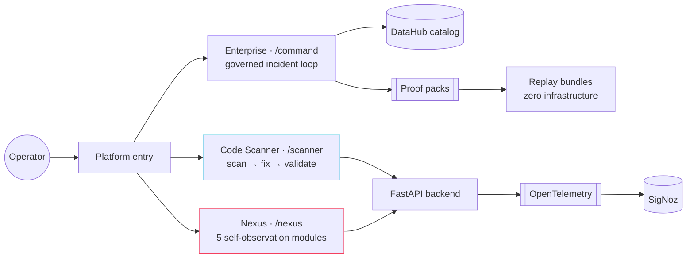

The Enterprise module is the one this project is built around, and the rest of
this README is mostly about it. The other two are documented in
[Code Scanner](#code-scanner) and [Nexus Commander](#nexus-commander).

---

## Overview

When a data pipeline breaks, the hard part is not noticing — it is *explaining*. Which upstream change caused it, what it touched downstream, who owns the asset, whether a proposed fix is safe, and whether any of that reasoning survives review.

DevGuard Enterprise is a **nine-agent system that answers those questions against a real DataHub catalog**, and writes what it learned back into the catalog so the next incident starts from more knowledge than the last one.

Three properties define the design:

1. **The catalog is the source of truth.** Blast radius comes from DataHub's column-level lineage, owners come from the graph, and remediation knowledge is written back as first-class DataHub entities — incidents, documents, tags, structured properties, ownership.
2. **Agents refuse rather than guess.** The Diagnostician has *zero tools* and reasons only over a typed evidence bundle. If the evidence chain cannot form, it returns `INSUFFICIENT_EVIDENCE` and the loop stops. This is enforced structurally, not by prompt wording.
3. **Every claim has an artifact behind it.** Each run emits a proof pack containing every tool call, evidence item, handoff and write-back. The UI reads its numbers out of those packs, and any value that was never measured renders `N/A` with the reason attached.

Observability is not an afterthought: every agent, handoff and decision is an OpenTelemetry span exported over OTLP to **SigNoz**, with a dashboard and alert rules that ship with the repository.

---

## The problem

Modern data platforms fail in ways that are individually cheap and collectively expensive:

- An upstream column is renamed. Downstream dbt models break. A churn model silently trains on a stale feature table.
- The engineer on call has the error message but not the lineage, the owner, or the history.
- The fix is applied, the incident is closed in chat, and **nothing is written down** — so the next occurrence costs exactly as much as this one.

Catalogs like DataHub already hold the missing context: lineage, schema, ownership, prior documentation. The gap is that nothing *reads* it during an incident, and nothing *writes back* to it afterwards.

DevGuard Enterprise closes both halves of that loop.

---

## How it works

A failure is detected from real runtime evidence, resolved to real catalog entities, explained from a typed evidence chain, fixed under human approval, verified, and written back:

| # | Agent | Kind | Tool allowlist | Responsibility |
|---|---|---|---|---|
| 1 | **Watcher** | deterministic | runtime evidence only | Detect the failure from exit codes and build output. Detection is the last place that should be probabilistic. |
| 2 | **Cartographer** | deterministic + MCP | `search`, `get_entities`, `list_schema_fields` | Resolve the failing artifact to real DataHub URNs and pull schema truth. |
| 3 | **Archivist** | deterministic + MCP | `search_documents`, `grep_documents` | Negotiate catalog capabilities, then retrieve prior runbooks. On a clean catalog it must find nothing *and say so distinguishably from an error*. |
| 4 | **Pathfinder** | deterministic + MCP | `get_lineage`, `get_lineage_paths_between`, `get_dataset_queries` | Column-level blast radius across datasets, plus a dataset-level traversal terminating at the ML model. |
| 5 | **Diagnostician** | **LLM** | **none** | Root cause from the typed evidence bundle only — or `INSUFFICIENT_EVIDENCE`. |
| 6 | **Surgeon** | deterministic | git branch/patch — **never apply** | Propose the minimal fix as a diff on a branch. |
| 7 | **Referee** | deterministic | test runner, verification queries | Validate the fix in a throwaway schema *before* approval; verify recovery *after* remediation. |
| 8 | **Magistrate** | deterministic | `get_entities` (owners, read-only) | Risk classification, autonomy policy, owner-routed approval. |
| 9 | **Scribe** | deterministic | five mutation tools | **The only agent that writes to DataHub.** Five knowledge artifacts, idempotent, stamped. |

**Two more roles appear on the Command Center's handoff rail**, which is why the
screenshots show **eleven** nodes rather than nine. Both are real participants
that do not own a handoff record, and the rail renders them rather than hiding
them:

| Role | Why it is on the rail but not in the loop table |
|---|---|
| **Sentinel** | The prompt-injection boundary ([`sentinel.py`](backend/v2/sentinel.py)). It writes proof-pack artifacts without emitting a handoff record, because the Surgeon owns the edge into it. It renders as `ran_no_record` with a duration of `None` — showing it as `idle` would be a lie about a security control that actually ran, and borrowing someone else's duration would be a fabricated measurement. |
| **Auditor** | A terminal that appears only as a handoff's `to_agent`, never as a `from_agent`, so it owns no record of its own. It renders `IDLE` when nothing reached it. |

The rail is **one node per agent, not one per handoff record**, on purpose: an
agent that never ran is itself a fact worth showing. `AGENT_ORDER` in
[`backend/v2/replay.py`](backend/v2/replay.py) is the rendering order.

### Model-backed vs deterministic — and why the split is the design

**Eight of the nine agents use no model at all.** Only the Diagnostician calls one, and it holds zero tools. That split is the design: an LLM cannot make an exit code more true, a deterministic agent cannot hallucinate, and the one agent that *does* reason cannot act.

Read the two properties together and a class of failure disappears:

| | Holds tools | Holds no tools |
|---|---|---|
| **Calls a model** | *nobody* — this quadrant is empty **by construction** | **Diagnostician** — reasons, cannot act |
| **Calls no model** | Cartographer · Archivist · Pathfinder · Magistrate · Scribe | Watcher · Surgeon · Referee |

The empty quadrant is the security property. Prompt-injected text sitting in a
DataHub description is read by the Cartographer, fenced by
[`sentinel.py`](backend/v2/sentinel.py), and reaches only the one agent that has
no tool to be hijacked into calling. There is no path from catalog free-text to
a mutation, because the agents that mutate never see a model's output as an
instruction. `AGENT_TOOL_ALLOWLISTS` in
[`backend/v2/handoff.py`](backend/v2/handoff.py) is the single source of truth for
that table, and [`tests/test_agent_allowlists.py`](tests/test_agent_allowlists.py)
(27 tests) fails the build if any agent gains a tool the docs do not list.

The inference provider is **Groq**, and it is the only one integrated — there is
no multi-provider abstraction, because one was never built. Two models are
selected between, by severity first and telemetry second:

| Constant | Model | Chosen when |
|---|---|---|
| `MODEL_STRONG` | `llama-3.3-70b-versatile` | severity is `high` or `critical`; always for the Validator |
| `MODEL_CHEAP` | `llama-3.1-8b-instant` | severity is `low` or `medium` |

`select_model()` in [`backend/core/ai_agent.py`](backend/core/ai_agent.py) is a
pure severity-only function that raises on an unrecognised severity rather than
defaulting downward — silently under-provisioning a critical scan is the one
failure mode routing must never have. `_select_model_adaptive()` wraps it with
recent cost trend and the CostGuardian's conservation flag, and every routing
decision it takes is recorded in the response rather than applied invisibly.
The client itself ([`groq_client.py`](groq_client.py)) is constructed lazily on
first use, so the backend imports — and the whole test suite runs — with no API
key present.

> **What the committed evidence shows.** Every recorded run in this repository executed with no model reachable — all 49 handoff records carry `model=null, tokens=0`, and the Diagnostician returns `REASONER_UNAVAILABLE`. The root causes in those runs were derived deterministically from runtime evidence, and each one says so in its own artifact. The refusal path, the evidence rule and the chain validation are proven; the quality of model reasoning is not. See [Limitations](#limitations).

### The evidence rule

A root cause is only valid if its chain contains **at least one `RUNTIME` evidence item and at least one `DATAHUB_GRAPH` item**. Runtime alone is an error message; graph alone is a theory. Requiring both is what makes the chain an explanation. If the chain cannot form, the Diagnostician refuses — and a refusal is recorded as a first-class outcome, not an error.

### The evidence model

Every fact an agent produces is a typed `Evidence` object, classified on three
independent axes ([`backend/v2/evidence.py`](backend/v2/evidence.py)). The axes are
separate because they answer different questions, and collapsing them into one
"confidence" number is how provenance gets lost:

| Axis | Values | The question it answers |
|---|---|---|
| **Source** | `RUNTIME` · `DATAHUB_GRAPH` · `DATAHUB_DOCUMENT` · `REPO_STATIC` · `DEVGUARD_INFERENCE` · `SEEDED_DEMO` | Where did this come from? |
| **Trust** | `TRUSTED_SYSTEM` · `UNTRUSTED_TEXT` | May it reach a prompt unfenced? |
| **Confidence** | `OBSERVED` · `DERIVED` · `INFERRED` | Was it measured, computed, or guessed? |

Two of those values exist specifically so that a category of quiet dishonesty is
impossible rather than discouraged. **`DEVGUARD_INFERENCE`** means the system
inferred an edge the graph did not contain — the Pathfinder never emits it, so an
inferred lineage hop can never be silently mixed in with real ones.
**`SEEDED_DEMO`** means demonstration data, and it cannot be laundered into
looking measured. Anything the catalog returns as free text is
`DATAHUB_DOCUMENT` + `UNTRUSTED_TEXT` **by construction** — the model refuses to
let it be classified as anything else — and it passes through the Sentinel before
any agent reads it.

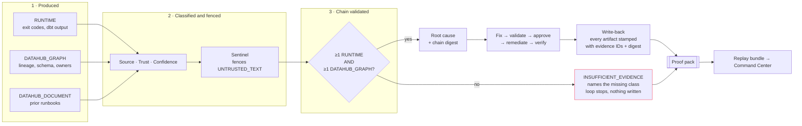

The chain digest is what makes the write-back auditable after the fact: every
artifact the Scribe lands carries the evidence IDs and the digest that justified
it, so a reader in six months can ask *which facts caused this tag to exist* and
get an answer rather than a timestamp.

### The write-back

Nothing is written before recovery is verified. When it is, the Scribe lands five artifacts and only then marks the incident resolved:

| # | Artifact | DataHub entity |
|---|---|---|
| 1 | Incident raised, then resolved | `incident` |
| 2 | Post-mortem runbook | `document` |
| 3 | Column-level tag + description | `schemaField` aspects |
| 4 | Structured properties (root-cause class, blast radius, duration) | `structuredProperties` |
| 5 | Ownership assignment | `ownership` |

Writes are idempotent on `(incident_id, artifact_type, target_urn)`, and every artifact is stamped with the evidence IDs and chain digest that justified it. A dry run records the exact payloads it *would* send and sends nothing.

### Live DataHub — what was verified against a running instance

A claim about DataHub is worth exactly as much as the run that produced it. So the
whole stack was provisioned from **the official `datahub docker quickstart`**,
interrogated, driven end to end, and photographed. Everything in this section is
regenerable by the scripts named beside it.

| | Verified |
|---|---|
| **DataHub Core** | `v1.7.0`, commit `7f81ccb` — read back from `GET /config`, not from documentation |
| **Services healthy** | GMS · GraphQL · frontend · OpenSearch 2.19.3 · Kafka (9 topics) · MySQL 8.2.0 |
| **Authentication** | `METADATA_SERVICE_AUTH_ENABLED=true`. Forged token → **401**, no token → **401**, service-account token → `urn:li:corpuser:devguard_agent` |
| **Least privilege** | **ALLOW 5/5, DENY 7/7** as the scoped service account, with `managePolicies`, `manageIngestion` and `manageDomains` all `false` |
| **Capabilities** | **25 verified · 2 present-but-empty · 0 absent · 0 error** across 27 probes |
| **MCP** | `uvx mcp-server-datahub@0.6.0` over stdio; server reports itself as `datahub 3.4.6`, protocol `2024-11-05` |
| **Incident loop** | Run end to end. All **5 write-back artifacts landed**; the next run **retrieved the runbook the previous one wrote** |

Evidence: **[`evidence/datahub-live/`](evidence/datahub-live/)** — service checks, the
auth-off/auth-on A/B, the resolved configuration table, and the capability matrix
with every raw GraphQL response kept verbatim.

**Two claims stopped carrying a caveat.** Both `ml_impact.py` and the ownership
path were implemented, tested, and honestly marked *"not yet executed against a
live catalog"*. They have now been executed:

- **Blast radius reaches the ML model.** Pathfinder walked `dataset → dataJob →
  mlModel` on a real graph and returned `reaches_ml_model=True` over 7 impacted
  assets. This required registering the trained model
  ([`substrate/ml/register_model.py`](substrate/ml/register_model.py)) — and the
  obvious modelling is wrong: `MLModelProperties.trainingData` produces **no
  traversable graph edge**, so a radius walked from `raw.users` stops at the mart
  and never reaches the model. The walkable path runs through a `dataJob`.
- **Ownership resolves from the graph.** The Magistrate returned `NAMED_OWNER`
  with an owner read from the catalog. Before this session nothing in the
  substrate had an owner, so the only truthful answer it could have given was
  `UNOWNED`.

Ownership, tags and glossary terms are now declared in the **dbt project** and
mapped in by DataHub's own `meta_mapping` ([`recipes/dbt.yml`](recipes/dbt.yml)),
so catalog governance is reproducible from a clone and reviewable in a diff. An
owner clicked into a UI vanishes on the next `datahub docker nuke`.

**dbt test results now reach DataHub as Assertions.** `test_results_path` in the
dbt recipe turns each dbt test into a first-class `Assertion` entity with run
events. That is what lets the Referee corroborate a recovery against a verdict
**it did not produce**: dbt decides whether `user_id` is still unique and
non-null, DataHub records the decision, DevGuard reads it back. A system grading
its own homework is not verification, and this is the seam that stops it being
that.

#### The capability matrix

Full table: **[`evidence/datahub-live/CAPABILITY_MATRIX.md`](evidence/datahub-live/CAPABILITY_MATRIX.md)**.
It is generated by [`scripts/verify_datahub_capabilities.py`](scripts/verify_datahub_capabilities.py),
which asks the live server **two separate questions** per capability — *is the
field in the introspected GraphQL schema*, and *did it return data* — because
collapsing those into one "supported" column is how a capability matrix starts
lying:

| Status | Meaning |
|---|---|
| ✅ `VERIFIED` | API present **and** this instance returned data. Only these may be called working. |
| 🟡 `PRESENT_NO_DATA` | API present and answered cleanly; the catalog holds no such data. |
| ⬜ `ABSENT` | Not in this server's schema. Not implemented in this build. |
| ❌ `ERROR` | The query failed. Message recorded verbatim. |

✅ Dataset · Schema · Lineage · Column Lineage (both by traversal *and* as the
`fineGrainedLineages` aspect) · Upstream Assets · Downstream Assets · Graph
Traversal · Relationships · Entity Health · Ownership · Domains · Glossary · Tags
· Browse Paths · Assertions · Policies · Governance privileges · Dataset Profiles
· ML Models · ML Metadata · Search · Structured Properties · Documentation ·
Incidents

🟡 **Freshness / Operations** and **Usage Statistics** — the APIs are present and
answer, but both need a source that can read a warehouse's own query history.
Snowflake, BigQuery and Redshift connectors emit it; DataHub's Postgres source
does not, so nothing in this substrate produces one. Inventing numbers to fill
those two panels is precisely what this repository refuses to do elsewhere.

⬜ Nothing. ❌ Nothing.

> **One finding shaped the prober itself.** DataHub models a physical table and
> the dbt node describing it as **siblings**, and merges them in the UI. GraphQL
> does not: profiling lands on the warehouse URN, ownership and assertions on the
> dbt one. A prober that asked only one side reported `PRESENT_NO_DATA` for
> ownership on a catalog that plainly had ownership. It now follows siblings and
> records **which URN answered** — the `[sibling]` markers in the matrix are that
> honesty made visible.

#### Capability negotiation is visible in the UI

The Command Center gained one panel, **Catalog surface**
([`CatalogSurface.tsx`](frontend/components/command/CatalogSurface.tsx)). The
DataHub tool list is what the server answered *for that run*, not a constant
compiled into the client — and that was captured as evidence and then never
shown.

It matters because the number changes for a reason: `search_documents` and
`grep_documents` are **absent from a catalog with no documents**, so the first run
against a clean instance negotiates **six** tools and the Archivist correctly
reports `DEGRADED`; after that run writes a runbook, the next negotiates
**eight** and retrieves it. Two numbers on a panel are the loop closing, and
unlike a sentence claiming it closed, they come out of the proof pack.

[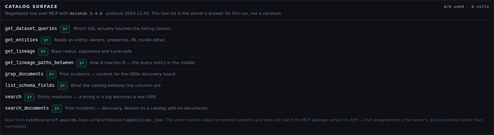](docs/screenshots/command-center/02-catalog-surface.png)

Tools that were offered and never called render dimmed rather than hidden — the
gap between *available* and *needed* is information about the agents, and hiding
it would turn the panel into a feature list. A tool called that the server never
offered would be a contract violation between the allowlist and the negotiated
set; it gets a red row, and
[`tests/test_replay_catalog_surface.py`](tests/test_replay_catalog_surface.py)
asserts it never happens.

### How DataHub is reached — MCP over stdio

`backend/v2/datahub_client.py` spawns the official server as a subprocess and speaks
**JSON-RPC 2.0 over stdio**:

```python
subprocess.Popen(["uvx", "mcp-server-datahub@0.6.0"], stdin=PIPE, stdout=PIPE, ...)
self._send({"jsonrpc": "2.0", "method": method, "params": params})
```

This matters for three reasons a reviewer can check:

1. **It is the real protocol.** Not an HTTP envelope shaped like MCP. The server's own
   `initialize` / `tools/list` / `tools/call` handshake is what runs — the captured tool
   list and full input schemas are in [`evidence/d0/`](evidence/d0/).
2. **Arguments are read, not guessed.** Agents construct calls against the live
   `inputSchema` returned by the server, which is why tool contracts can be asserted in
   tests with no server running.
3. **The allowlist sits in front of the pipe.** Tool, entity-type and URN-scope checks
   run in `DataHubMCPClient.call` *before* a request is serialised, so a violation is a
   Python exception with a stack trace rather than a server-side rejection to interpret.

**Tools used — 8 read, 5 write, of the 18 the server exposes:**

| Read | Write (Scribe only) |
|---|---|
| `search` · `get_entities` · `list_schema_fields` | `add_tags` · `update_description` |
| `get_lineage` · `get_lineage_paths_between` | `save_document` |
| `get_dataset_queries` | `add_structured_properties` · `add_owners` |
| `search_documents` · `grep_documents` | |

Incidents are not exposed over MCP in self-hosted DataHub, so artifact 1 drops to raw
GraphQL (`raiseIncident` / `updateIncidentStatus`) — documented rather than skipped.

### What DevGuard reasons about from the catalog

"Uses DataHub" can mean one search call. This is the full list of distinct
reasoning tasks that read the catalog, what each one is for, and where to check it:

| Reasoning task | Agent | Catalog surface | Why the catalog is the only place this can come from | Proof |
|---|---|---|---|---|
| **Entity resolution** — a string in a log (`stg_users`, `user_id`) becomes a real URN | Cartographer | `search`, `get_entities` | This is the seam where a system quietly starts analysing the wrong asset. It gets its own agent and its own failure mode: unresolvable means *say so*, never guess | [`cartographer.py`](backend/v2/agents/cartographer.py) |
| **Schema truth** — what the catalog believes the columns are | Cartographer | `list_schema_fields` | During drift the catalog says `user_id` and the database says `customer_id`, and **the gap between them is the incident**. The agent must not "helpfully" reconcile them | [`cartographer.py`](backend/v2/agents/cartographer.py) |
| **Prior knowledge** — has this happened before? | Archivist | `search_documents`, `grep_documents` | Runbooks a previous incident wrote. On a clean catalog the tools are *hidden by the server*, so the agent must return `DEGRADED`, not throw | [`archivist.py`](backend/v2/agents/archivist.py) · [`test_archivist_retrieval.py`](tests/test_archivist_retrieval.py) (16 tests) |
| **Blast radius** — column-level, downstream | Pathfinder | `get_lineage` (paginated, cycle-safe) | Only the graph knows which dbt models and dashboards consume a renamed column. Grep cannot | [`pathfinder.py`](backend/v2/agents/pathfinder.py) |
| **Path reasoning** — *how* A reaches B | Pathfinder | `get_lineage_paths_between` | The returned path's middle element is a `urn:li:query:` entity — the actual SQL. That is what ties "there is SQL touching this column" to "here is where it goes" | [`pathfinder.py`](backend/v2/agents/pathfinder.py) |
| **ML impact** — the model at the end of the radius, read rather than counted | Pathfinder | `get_entities` on the terminal `mlModel` | `mlModelTrainingData` produces **no graph edge**, so the traversable path is `dataset → dataJob → mlModel`; the agent walks entity *types* instead of assuming the last hop is a dataset | [`ml_impact.py`](backend/v2/ml_impact.py) · [`test_ml_impact.py`](tests/test_ml_impact.py) (28 tests) |
| **Query provenance** | Pathfinder | `get_dataset_queries` | Which SQL actually touches the failing column | [`pathfinder.py`](backend/v2/agents/pathfinder.py) |
| **Ownership** — who must approve | Magistrate | `get_entities` (owners, read-only) | Owners come from the graph, never from config. An unowned production table with a live incident is itself a **governance finding**, reported as `UNOWNED` rather than routed to a default approver | [`magistrate.py`](backend/v2/agents/magistrate.py) |
| **Recovery corroboration** | Referee | DataHub assertions, read-only | An independent second opinion on "is it actually fixed", from the catalog rather than from DevGuard's own test run | [`assertions.py`](backend/v2/assertions.py) · [`test_assertion_corroboration.py`](tests/test_assertion_corroboration.py) (27 tests) |
| **Write-back** — five artifacts | Scribe | 5 mutation tools + GraphQL incidents | The loop only closes if what was learned becomes catalog state the next incident can read | [`scribe.py`](backend/v2/agents/scribe.py) · [`test_writeback_rules.py`](tests/test_writeback_rules.py) (35 tests) |

**Two of these rows used to carry a caveat, and no longer do.** **ML impact** and
**ownership** were implemented, tested and marked *"not yet executed against a
live catalog"*. Both ran against DataHub v1.7.0 this session —
`reaches_ml_model=True` over 7 impacted assets, and `NAMED_OWNER` with an owner
read from the graph. See [Live DataHub](#live-datahub--what-was-verified-against-a-running-instance).

**One caveat remains, and it is about DataHub rather than about DevGuard.**
Assertions are now real: dbt's test results are ingested as first-class
`Assertion` entities with run events, and the Referee reads them. But DataHub OSS
has **no `reportAssertionResult` mutation**, so DevGuard *corroborates* assertions
without ever authoring one. That asymmetry is deliberate on DataHub's side and
recorded here rather than worked around.

**Five live-server behaviours shaped this code**, and they are worth reading as
integration findings rather than trivia — each one is a place where the obvious
implementation is wrong:

1. There is no `Runbook` document type, so the runbook is written as `Analysis` — the nearest honest alternative, rather than inventing a type.
2. **A tag must exist before it can be applied**, and the Scribe deliberately does *not* create one: `add_tags` against an unknown tag URN fails with `Failed to validate label … Urn does not exist`, and an agent that can invent vocabulary can invent meaning. The vocabulary is therefore an operator responsibility, declared in [`scripts/provision_catalog.py`](scripts/provision_catalog.py). The first live run failed artifact 3 for exactly this reason, which is how the gap was found.
3. A string property whose value parses as a URN **breaks `searchAcrossLineage`** — which is why `devguard.last_incident_id` stores a bare id and not a URN.
4. **`MLModelProperties.trainingData` produces no traversable graph edge.** Model the training run as a `dataJob` instead, or a blast radius walked from the source table stops at the mart and silently never reaches the model it breaks.
5. **Aspects split across sibling entities.** DataHub treats a warehouse table and the dbt node describing it as siblings and merges them in the UI; GraphQL does not. Profiling lands on one, ownership and assertions on the other. Code that reads one URN and concludes "no owner" is reading half the entity.

Two of the findings encountered along the way were verified against DataHub
`master` and written up for upstream in [`docs/upstream/`](docs/upstream/).
They are **prepared, not filed** — and
[`tests/test_upstream_claims.py`](tests/test_upstream_claims.py) fails the build
if a filing checkbox is ticked while that remains true.

---

## Architecture

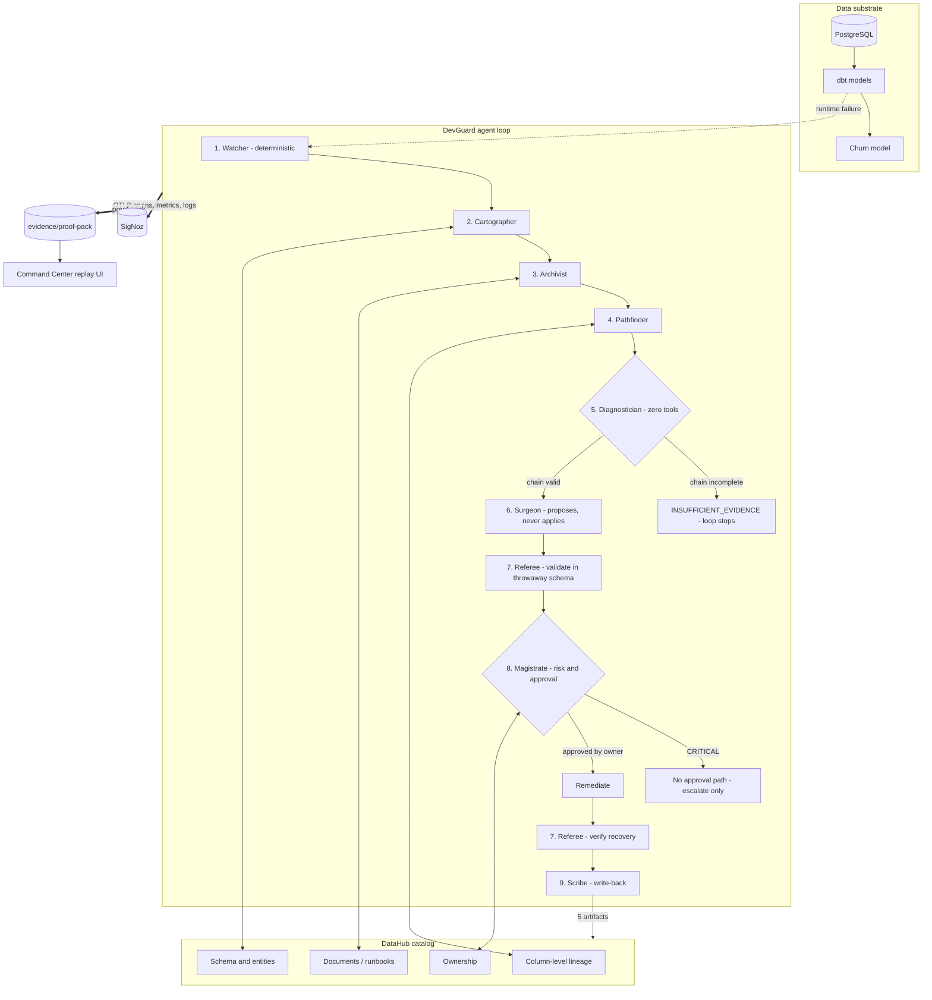

Full component-by-component detail, including the evidence type system and the handoff contract, is in **[ARCHITECTURE.md](ARCHITECTURE.md)**. An independent component-by-component critique, including what scores badly, is in **[docs/ARCHITECTURE_REVIEW.md](docs/ARCHITECTURE_REVIEW.md)**.

If you are evaluating this project against the hackathon's criteria, **[docs/JUDGING_MATRIX.md](docs/JUDGING_MATRIX.md)** maps every shipped capability to the artifact that proves it, and states where each row is weaker than it looks. Its paths and figures are checked by `tests/test_judging_matrix.py`, so it fails the build rather than quietly going stale.

### Observability with SigNoz

Every agent boundary is instrumented. One incident produces one distributed trace whose spans carry the agent name, the evidence IDs consumed, the decision taken, measured duration, and token/model attribution where a model was used. Logs are bridged onto the same trace via OpenTelemetry's `LoggingHandler`, so a log line can be read in the context of the decision that emitted it.

Shipped in this repository:

- `signoz/dashboard.json` — imported and rendering against SigNoz v0.135.0
- `signoz/alerts/` — three alert rules (LLM error burst, circuit-breaker flapping, LLM cost budget), applied and verified loaded
- `scripts/apply_signoz_assets.sh` — installs the dashboard and all three rules, then verifies
- `scripts/verify_otel.py` — stands up an in-process OTLP/gRPC receiver, boots the real application, drives traffic and asserts against **decoded protobuf**

That last script matters: it proves the telemetry pipeline end to end without needing SigNoz to be running, which is why it runs in CI on every push.

---

## Screenshots

Every image below is a capture of this system running — against a real SigNoz
v0.135.0, a real DataHub Core instance, or the committed replay bundles. None is
a mockup.

**The Command Center — the two runs worth comparing**

| Completed loop (`d6-loop-pass2`) | Refusal (`d5-refusal`) |
|---|---|
| [](evidence/d10/screenshots/d6-loop-pass2.png) | [](evidence/d10/screenshots/d5-refusal.png) |
| 10 handoffs · 9 MCP calls · 30 evidence items · **5 write-back artifacts landed**. Blast radius terminates at `devguard_churn_risk` (MLMODEL, 5 hops). The prior-incident panel shows **4 runbooks retrieved from the catalog** — knowledge a previous run wrote. | `CHAIN INSUFFICIENT` · 4 evidence items, **all `RUNTIME`** · Diagnostician `REFUSED`. The panel names the missing class — **`DATAHUB_GRAPH`** — and every downstream section states *why* it is empty rather than rendering blank. |

Put side by side these two make the central claim checkable: the same UI, the
same pipeline, and the difference between an explanation and a refusal is
whether the evidence chain contained both required classes. Note in **both**
that tokens and cost read `N/A` with the reason attached — never `0`.

**SigNoz — the telemetry is real and the assets ship with the repository**

| Services — `devguard-backend` reporting | A stored distributed trace, 9 spans |
|---|---|
| [](docs/screenshots/signoz/01-services.png) | [](docs/screenshots/signoz/02-distributed-trace.png) |
| Real spans arriving over OTLP/gRPC from the running application. | `scan_request → resilient_pipeline → llm_invoke → devguard_pipeline → scanner_agent`, with `cache_lookup` beside it. **This is a Scanner trace, and it is red:** 8 of its 9 spans carry errors, because the model call failed in the capture environment. It is included as-is — a green trace we did not record would be the wrong thing to show. The nine-agent Enterprise chain in a single trace is **not yet captured**; see [Limitations](#limitations). |

| Dashboard — [`signoz/dashboard.json`](signoz/dashboard.json), imported | Alert rules — [`signoz/alerts/`](signoz/alerts/), applied and `OK` |
|---|---|
| [](docs/screenshots/signoz/03-dashboard.png) | [](docs/screenshots/signoz/04-alert-rules.png) |
| The committed dashboard definition, rendering against SigNoz v0.135.0. | All three rules the repository ships, loaded and healthy: `devguard-circuit-breaker-flapping` (critical), `devguard-llm-cost-budget` and `devguard-llm-error-burst` (warning) — one file each in [`signoz/alerts/`](signoz/alerts/), installed and verified by [`scripts/apply_signoz_assets.sh`](scripts/apply_signoz_assets.sh). |

**DataHub v1.7.0 — the catalog this project stood up**

All 23 images in [`docs/screenshots/datahub/`](docs/screenshots/datahub/) were
captured by [`scripts/capture_datahub_screenshots.py`](scripts/capture_datahub_screenshots.py)
driving a real browser against the live instance. Full index with a caption per
shot: [`docs/screenshots/datahub/README.md`](docs/screenshots/datahub/README.md).

| The ML feature table, as ingested | Lineage — the whole hero path, ML terminus included |
|---|---|
| [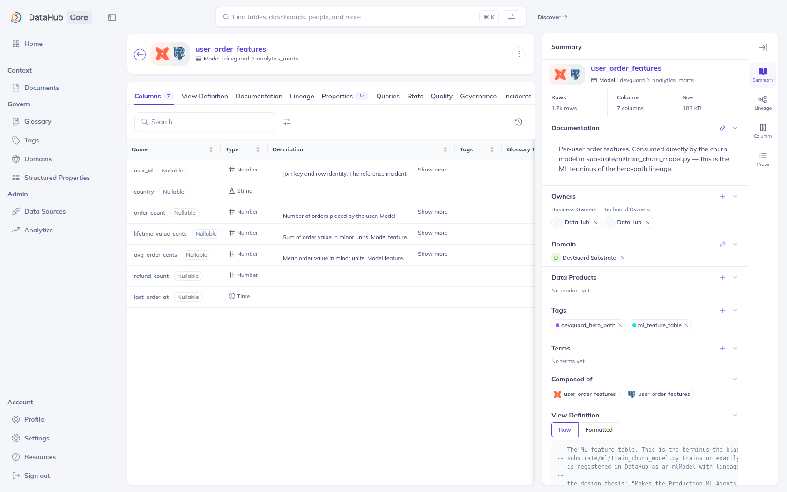](docs/screenshots/datahub/05-dataset.png) | [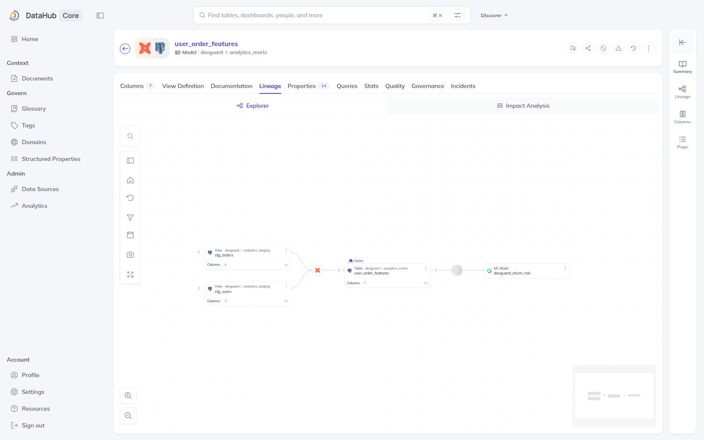](docs/screenshots/datahub/07-dataset-lineage.png) |
| 1.7k rows, 7 columns, **Business and Technical Owners**, the **DevGuard Substrate** domain, and the `devguard_hero_path` / `ml_feature_table` tags — every one of them declared in the dbt project and ingested, none clicked in. *Composed of* shows DataHub's two sibling entities for the same table. | `stg_orders` + `stg_users` → `user_order_features` → **`train_churn_model`** → **`devguard_churn_risk` (ML Model)**. The edges are ingested from the running stack; the `dataJob` hop in the middle is what makes the model reachable at all. |

| Column lineage, expanded | Assertions — dbt's verdicts, in the catalog |
|---|---|
| [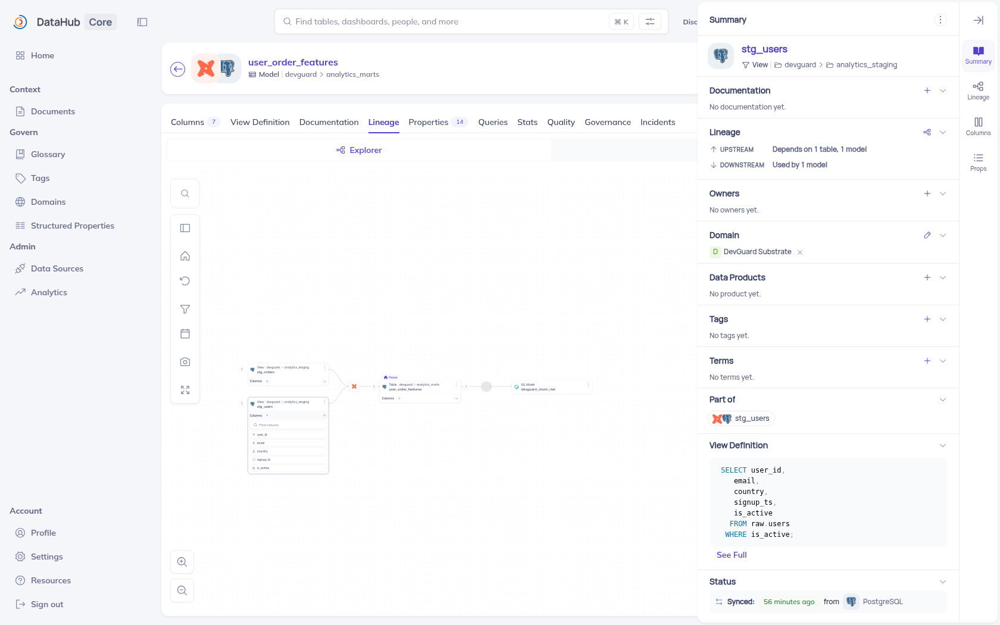](docs/screenshots/datahub/08-column-lineage.png) | [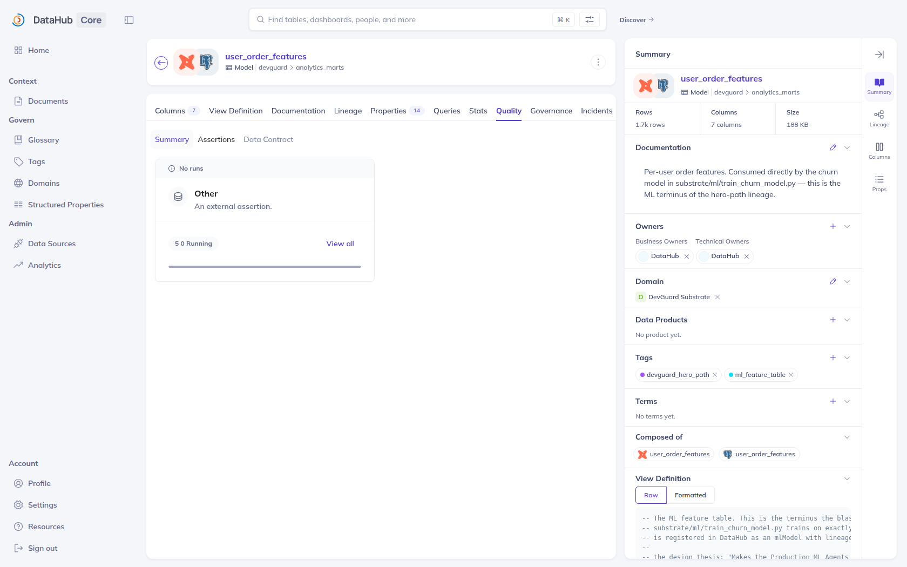](docs/screenshots/datahub/11-dataset-quality.png) |
| Field-level detail, derived by DataHub's dbt source from the manifest dbt itself produced. Note the sidebar's **"Some upstreams are unhealthy"** — that is a live health signal DataHub computes from assertion results. | The 13 dbt tests, ingested as first-class `Assertion` entities with run events. This is the independent second opinion the Referee reads: dbt's verdict, not DevGuard's. |

**And what DevGuard wrote back** — the same UI a human would use, showing the
agent's output after a verified recovery:

| Artifact 1 — the incident, raised and resolved | Artifact 4 — structured incident facts |
|---|---|
| [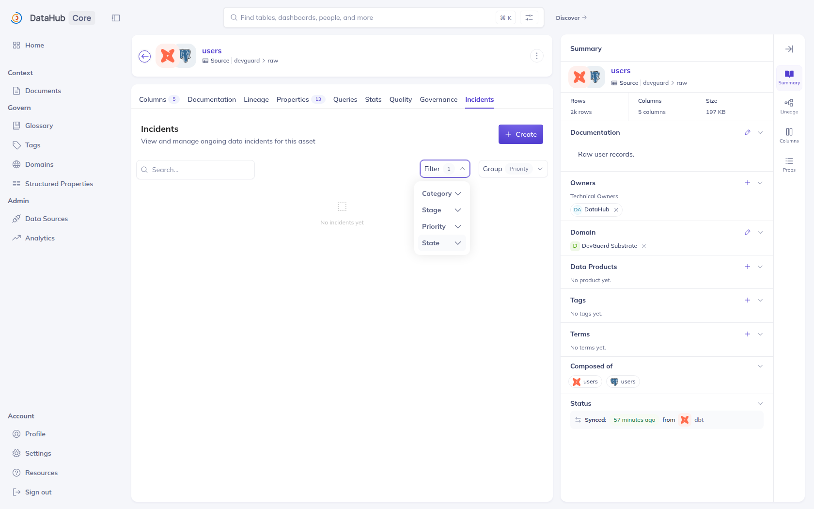](docs/screenshots/datahub/19-writeback-incident.png) | [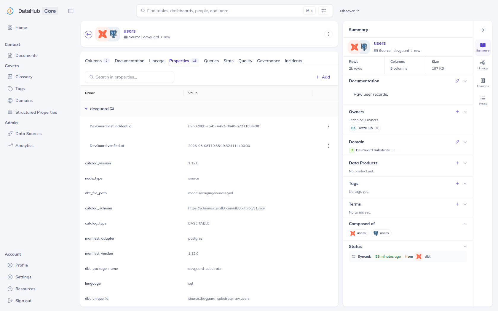](docs/screenshots/datahub/21-writeback-properties.png) |
| Raised on detection, resolved **only** after the Referee verified the fix. Filtered to *Resolved* on purpose: a completed run leaves nothing active, so the default view of a run that worked is an empty table. | `devguard.verified_at` and `devguard.last_incident_id` as typed catalog values under their own namespace — definitions registered first, from [`recipes/structured_properties.yaml`](recipes/structured_properties.yaml). |

> **The gap this closes.** Until this session the two DataHub screenshots in this
> README showed a clean catalog *before* any write-back — no tags, no owners, and
> a lineage canvas that had not rendered its edges — and a post-write-back capture
> was listed in [Limitations](#limitations) as the one screenshot the repository
> was missing. It is no longer missing. The earlier captures are kept at
> [`evidence/d2/screenshots/`](evidence/d2/screenshots/) because they are the
> provenance of the v1.6.0-era artifacts, not because they are the best available
> picture.
>
> The underlying aspect is still the stronger proof of column-level lineage, and
> it is still where a sceptic should look — `fineGrainedLineages` carrying
> `downstreamType: FIELD`:
> [`02-upstreamLineage-features.json`](evidence/d2/02-upstreamLineage-features.json) ·
> [`03-upstreamLineage-dbt-features.json`](evidence/d2/03-upstreamLineage-dbt-features.json) ·
> [`04-lineage-chain.json`](evidence/d2/04-lineage-chain.json).

<sub>Screenshots live in [`docs/screenshots/datahub/`](docs/screenshots/datahub/) (23, DataHub v1.7.0), [`docs/screenshots/command-center/`](docs/screenshots/command-center/), [`evidence/d10/screenshots/`](evidence/d10/screenshots/), [`evidence/d2/screenshots/`](evidence/d2/screenshots/) and [`docs/screenshots/signoz/`](docs/screenshots/signoz/). Click any image for the full-resolution capture. The Command Center images are reproducible on any machine — `make demo`, then open the run picker. The DataHub and SigNoz images need their respective stacks running, which is why they are captured rather than regenerated in CI; both capture scripts are committed, and `MANIFEST.json` in the DataHub directory records the outcome of every attempt including any that failed.</sub>

---

## Demo — replay a real recorded run

The Command Center replays **recorded runs from the committed proof packs**, with no DataHub, no PostgreSQL, no API key and no backend:

```bash
make demo
```

That runs the preflight check, rebuilds the replay bundles from the committed
proof packs, builds the static Command Center and serves it — then tells you
which runs are worth opening first. Open <http://localhost:8080/command/>.

`make replay-serve` does the same without the preflight step, on port 8000.
`make reset-demo` regenerates the bundles from the proof packs if a local run
has left them modified.

Seven recorded runs are selectable:

| Run | What it shows |
|---|---|
| `d6-loop-pass2` | The complete loop, ending in five write-back artifacts that really landed in DataHub |
| `d6-loop-pass1` | The same loop's first clean-state pass |
| `d6-dry-run` | Every write payload recorded, nothing sent |
| `d6-fail-the-fix` | The proposed fix failing validation — the loop never reaches a human and never writes |
| `d5-refusal` | The Diagnostician declining to guess, naming the exact evidence class it lacked |
| `d5-full` | A complete diagnosis over a two-sided evidence chain |
| `d4-evidence-chain` | The evidence chain forming from real captured evidence |

Every number on that screen is read out of a proof pack, and every evidence chip opens the exact captured request/response behind its claim. Values that were never measured render `N/A` with the reason attached. A banner reads **REPLAY OF RECORDED RUN — NOT LIVE** and cannot be dismissed.

To check that claim rather than take it:

```bash
make verify-replay-ui   # drives the built static site in a real browser
```

```
14/14 checks passed
```

A recording walkthrough is in **[DEMO.md](DEMO.md)**.

---

## Quick start

Requires **Python 3.11+** and **Node 20.9+**. No API key, no catalog and no collector are needed for any of the following.

```bash
git clone https://github.com/akashbichukale111/DevGuard-Enterprise.git
cd DevGuard-Enterprise

python -m venv venv && source venv/bin/activate
pip install -r requirements.txt
cd frontend && npm ci && cd ..

make doctor    # reports exactly what is present and what is missing
make test      # 1096 tests — no key, no collector, no network
make replay    # build replay bundles from the committed proof packs
```

To run the live application (a Groq API key is needed only for `POST /scan`):

```bash
cp .env.example .env        # add GROQ_API_KEY if you have one
python -m uvicorn backend.main:app --reload --port 8000
cd frontend && npm run dev
```

Open <http://localhost:3000>.

Full instructions, including the DataHub catalog and the data substrate, are in **[docs/INSTALLATION.md](docs/INSTALLATION.md)**.

---

## Installation

| Path | What you get | Requirements |
|---|---|---|
| **Replay only** | The Command Center over recorded runs | Python + Node |
| **Application** | Scanner UI, API, telemetry | + Groq API key for `POST /scan` |
| **Full stack** | The live agent loop against a real catalog | + DataHub Core, PostgreSQL substrate, dbt |
| **With SigNoz** | Traces, dashboard, alerts | + a SigNoz deployment |

Each path is documented step by step in **[docs/INSTALLATION.md](docs/INSTALLATION.md)**; deployment topologies are in **[DEPLOYMENT.md](DEPLOYMENT.md)**.

---

## Documentation map

Every document in this repository, what it is for, and who it is for. There is
one page per concern — where two would have overlapped, they were merged rather
than cross-published.

**Evaluating the project**

| Document | Read it for |
|---|---|
| [docs/JUDGE_WALKTHROUGH.md](docs/JUDGE_WALKTHROUGH.md) | Five minutes, no infrastructure. The four runs worth your time. |
| [docs/JUDGING_MATRIX.md](docs/JUDGING_MATRIX.md) | Every capability → the artifact that proves it → **where the row is weaker than it looks**. Build-enforced. |
| [docs/ARCHITECTURE_REVIEW.md](docs/ARCHITECTURE_REVIEW.md) | An independent component-by-component critique, reverse-engineered from source. Includes what scores badly. |
| [docs/LLM_EGRESS_BLOCKED.md](docs/LLM_EGRESS_BLOCKED.md) | Proof that the missing model runs are a network-egress cause, not a missing credential. |
| [docs/DEVPOST.md](docs/DEVPOST.md) | The submission copy. |
| [DISCLOSURE.md](DISCLOSURE.md) | What was authored when, and what the evidence does and does not show. |
| [evidence/datahub-live/](evidence/datahub-live/) | **DataHub v1.7.0, stood up and interrogated.** The capability matrix, the auth-off/auth-on A/B, the resolved configuration, the service checks. |
| [docs/screenshots/datahub/](docs/screenshots/datahub/) | 23 captures of the live instance, one caption each, `MANIFEST.json` recording every attempt. |

**Understanding the engineering**

| Document | Read it for |
|---|---|
| [ARCHITECTURE.md](ARCHITECTURE.md) | Component-by-component detail: the evidence type system, the handoff contract, agent internals. |
| [docs/API.md](docs/API.md) | Every endpoint, error semantics, and configuration variable. |
| [SECURITY.md](SECURITY.md) | Threat model, the mutation allowlist, least-privilege verification, disclosure policy. |
| [docs/MCP_DECISION.md](docs/MCP_DECISION.md) | Why the SigNoz MCP path is designed but not demonstrated — the trade-off, written down. |
| [docs/upstream/](docs/upstream/) | Two findings verified against DataHub `master`, prepared for upstream. |

**Running it**

| Document | Read it for |
|---|---|
| [docs/INSTALLATION.md](docs/INSTALLATION.md) | Four install paths, step by step. |
| [DEPLOYMENT.md](DEPLOYMENT.md) | Deployment topologies and host-by-host instructions. |
| [docs/REPRODUCIBILITY.md](docs/REPRODUCIBILITY.md) | Every command that runs on a clean clone, with expected output. |
| [DEMO.md](DEMO.md) | The recording walkthrough. |

**Contributing and governance**

| Document | Read it for |
|---|---|
| [CONTRIBUTING.md](CONTRIBUTING.md) | Development setup and the checks that must pass. |
| [CODE_OF_CONDUCT.md](CODE_OF_CONDUCT.md) | Community expectations. |
| [CHANGELOG.md](CHANGELOG.md) | What changed, in Keep a Changelog form. |
| [LICENSE](LICENSE) | Apache-2.0. |

**Generated results** — [examples/eval/](examples/eval/) ·
[examples/ablation/](examples/ablation/) · [evidence/](evidence/)

---

## Features

**Agent platform**
- Nine bounded agents, each with an explicit tool allowlist enforced *before* the request reaches the wire
- Typed handoffs recording `from_agent`, `to_agent`, evidence IDs, decision, duration, tokens and model
- Structural refusal — `INSUFFICIENT_EVIDENCE` is a designed outcome, not a failure path
- Column-level blast radius across datasets; a dataset-level traversal terminates at the ML model

**DataHub integration**
- Read: search, entity resolution, schema fields, column-level lineage, lineage paths, dataset queries
- Write: five knowledge artifacts through a five-tool mutation allowlist held by one agent
- Idempotent writes keyed on `(incident_id, artifact_type, target_urn)`
- Dedicated least-privilege service account, with denied privileges verified as live `DENY`s

**Observability (SigNoz)**
- Distributed traces across every agent and handoff, over OTLP/gRPC
- Log-to-trace correlation via the OpenTelemetry logging bridge
- Shipped dashboard and three alert rules, with an installer and a verifier
- Circuit breaker with graceful degradation and an automatic postmortem when it trips

**Evidence and verification**
- A proof pack per run: every tool call, evidence item, handoff and write-back
- Zero-infrastructure replay UI built from those packs
- Fault-injection evaluation suite with a negative control
- Retrieval ablation study with interleaved arms
- Hash-chained, tamper-evident audit trail

**Engineering**
- 1096 tests running in CI on every push with no key, no collector and no network
- Secret scanning over the working tree *and* the full git history
- Dependency advisory reporting on every push
- `make doctor` preflight that names every missing prerequisite and how to satisfy it

---

## Code Scanner

`/scanner` — a three-agent reflection loop over source code. It is a separate
pipeline from the Enterprise agents and has its own Validator, which reviews a
proposed patch; the Enterprise `Referee` verifies a recovery. Different scope,
different component.

```
Scanner Agent  ──▶  Fixer Agent  ──▶  Validator Agent  ──┐
   detect              patch            adversarial       │  verdict = fail
   CWE + severity      minimal diff     review            │  and attempts left
       ▲                                                  │
       └──────────────  reflection, max 3 attempts  ◀──────┘
```

The Validator is skeptical by default and returns a verdict, an eval score, the
CWE ids it considers unresolved, and feedback the Fixer must address on the next
attempt. The loop converges or stops at three attempts — it never silently
accepts a patch.

**Four ways to get code in**

| Input | Endpoint | Notes |
|---|---|---|
| Paste into the editor | `POST /scan` | Monaco editor, served from this origin — no CDN |
| Upload a source file | `POST /scan` | Read in the browser; the extension selects the language |
| Upload a ZIP archive | `POST /scan/zip` | Read in memory, never extracted to disk |
| Public repository | `POST /scan/repository` | Shallow clone, scanned, then deleted |

**Languages** — Python, JavaScript, TypeScript and Java. The language is not
cosmetic: it reaches the Scanner, Fixer and Validator prompts, and it is part of
the cache key, so the same bytes scanned as Java and as Python are two different
scans. The registry in [`backend/core/languages.py`](backend/core/languages.py)
is the single source of truth, served at `GET /languages` so the UI cannot
advertise a language the pipeline does not handle.

**Retrieval** — 16 CWE classes are held in a knowledge base and retrieved as
prompt context ([`backend/core/rag_store.py`](backend/core/rag_store.py)). The
model is not limited to those 16; they are the grounding context, not an
allowlist.

**Project scans are bounded on purpose.** Every collected file is a full
Scanner → Fixer → Validator run, so an unbounded repository walk is both a cost
incident and a denial-of-service vector. Collection caps at 25 files after
pruning dependency, build and minified paths, and whatever the cap leaves out is
reported as `source_files_found` and `truncated` rather than dropped quietly.

**Both inputs are treated as hostile**, because both are:

| Vector | Handling |
|---|---|
| Zip slip | Entries with absolute paths or `..` are rejected, not sanitised |
| Zip bombs | Uncompressed sizes checked from archive metadata *before* decompressing, and re-checked against real bytes |
| Archived symlinks | Skipped, so a link at `/etc/shadow` cannot make a scan read host files |
| SSRF | `https://` only, on a host allowlist; `file://`, `git://`, `ssh://`, localhost, RFC1918 and the cloud metadata endpoint are all unreachable |
| Credential leakage | Credentials and ports in a repository URL are refused; the clone URL is rebuilt from parsed components so a query string cannot smuggle a git option |
| Argument injection | `git` runs through an argument list, never a shell, with credential prompts disabled |

A run where every file failed reports `failed` — not `complete` with zero
findings, which would read as a clean bill of health for code that never
reached the model. Partial failures report `complete_with_errors`, and finding
totals count only files that were actually analysed.

Covered by [`tests/test_project_scan.py`](tests/test_project_scan.py) and
[`tests/test_project_scan_api.py`](tests/test_project_scan_api.py).

---

## Nexus Commander

`/nexus` — five modules that observe the platform's own behaviour, runnable
individually or concurrently.

| Module | Role | What it does |
|---|---|---|
| **Omni-Heal** | Autonomous Code Remediation | Runs the Scanner → Fixer → Validator reflection loop and streams the resulting diff back |
| **FinOps Agent** | Autonomous Cost Controller | Reads LLM spend trends and recommends OTel sampling-ratio adjustments before budget pressure forces a model downgrade |
| **Pre-Cog Ops** | Future-State Predictor | Extrapolates the **measured** pipeline error rate and memory drift across a rolling horizon to forecast circuit-breaker trips and OOM risk. With no scans in the window there is no rate, so it returns `N/A` with the reason and draws no forecast rather than seeding one |
| **Truth Serum Agent** | LLM Hallucination Judge | Cross-examines the Scanner's own findings, flagging low-confidence or fabricated vulnerabilities before they reach the Fixer |
| **Executive SRE Commander** | Mobile Sync & Incident Digest | Aggregates the other four into one incident brief |

Every panel carries a **data-source badge**, computed from the `data_source`
field the backend actually returned rather than chosen by the UI:

| Badge | Meaning |
|---|---|
| **Live** | Retrieved from SigNoz |
| **Local** | Really measured in this process, but by an in-process heuristic rather than retrieved from SigNoz — deliberately *not* badged Live |
| **Partial** | Some fields real, some synthetic; the panel names which |
| **Simulated** | Synthetic |
| **Unlabelled** | The response carried no `data_source` — shown rather than assumed |

That `Local` / `Live` distinction is the point of the label, not a hedge:
several of these modules are simulators, and they say so on screen instead of
presenting themselves as live measurements.

Panels render **"No run yet"** until a run returns real data. They never show
sample or placeholder figures to fill space, which is why the page looks empty
before you press anything — that is the honest state, not a loading bug.

---

## Technology stack

| Layer | Technology | Version | How it was established |
|---|---|---|---|
| Catalog | DataHub Core | `v1.7.0` (commit `7f81ccb`) | Read back from the running instance's `GET /config` |
| Catalog search | OpenSearch | `2.19.3` | `GET :9200` on the live instance |
| Catalog event bus | Kafka (`confluentinc/cp-kafka`) | `8.2.2` | 9 topics listed on the live broker |
| Catalog store | MySQL | `8.2.0` | `SELECT VERSION()` on the live instance |
| Catalog protocol | DataHub MCP server | `0.6.0` — reports itself as `3.4.6` | `initialize` handshake over stdio |
| Catalog SDK / CLI | `acryl-datahub` | `1.7.0` | `datahub version` |
| Observability | SigNoz | `v0.135.0` | Verified in an earlier session; see [Screenshots](#screenshots) |
| Telemetry | OpenTelemetry (traces, metrics, logs) over OTLP/gRPC | `1.20.0` | — |
| Backend | FastAPI, Python, async throughout | `3.11` | — |
| Frontend | Next.js App Router, TypeScript, Tailwind, Framer Motion, Monaco | `16` | — |
| Transformation | dbt Core over PostgreSQL | `1.12.0` / adapter `1.11.0` / PG `16` | `dbt --version` against the live substrate |
| Browser automation | Playwright + Chromium (screenshot capture) | Chromium `141` | `browser.version` at capture time |
| Inference | Groq (Llama 3.3 70B / 3.1 8B, severity- and telemetry-routed) | — | **Never reached** in any recorded run ([why](docs/LLM_EGRESS_BLOCKED.md)) |

Every version above is pinned in [`versions.env`](versions.env) and resolved, not
floating. That file records **two DataHub generations on purpose**: `v1.6.0` is
the stack the committed `d4`/`d5`/`d6-loop` proof packs were captured against, and
deleting it would make those artifacts unreproducible; `v1.7.0` is what a
reviewer gets from `datahub docker quickstart` today and what
[`evidence/datahub-live/`](evidence/datahub-live/) was produced against.

---

## Evidence

`evidence/` is the repository's verification surface. It is committed deliberately: the claims in this README are checkable without running anything.

```
evidence/
├── proof-pack/          one directory per recorded run
│   ├── ablation/        10 runs, 5 per arm
│   ├── eval/            per-fault dbt output, including the green baseline
│   ├── security/        injection demo, least-privilege ALLOW/DENY checks
│   ├── d6-live-v170/    the loop run end to end against DataHub v1.7.0
│   └── d4…d6-*/         the evidence chain, the refusal, and the full loop
├── datahub-live/        DataHub v1.7.0 provisioned and interrogated:
│                        capability matrix (25/27 verified), the auth-off vs
│                        auth-on A/B, the resolved configuration table
└── d0…d10/              per-stage capture: MCP tool schemas, lineage JSON,
                         write-back responses, blast-radius payloads, screenshots
```

A proof pack contains, for every agent in the run: the exact request and response of each tool call, the evidence items produced with their type and provenance, the handoff record, and — for the Scribe — the write-back payload and the catalog's response to it.

The replay UI is built from exactly these files, so what a reviewer sees on screen and what is on disk cannot diverge.

**Two generations, both kept.** `d0`–`d10` were captured against DataHub v1.6.0
and are the provenance of the committed proof packs and of the findings in
[`docs/upstream/`](docs/upstream/). `datahub-live/` and `d6-live-v170` were
captured against v1.7.0 this session. Neither supersedes the other: deleting the
older set would make its artifacts unreproducible, and presenting only the older
set would understate what has been verified. [`versions.env`](versions.env) pins
both.

**The failure that is kept on purpose.**
[`02-least-privilege-AUTH-OFF.txt`](evidence/datahub-live/02-least-privilege-AUTH-OFF.txt)
is a **failed** verification run — ALLOW 4/4, DENY 0/7 — against the stock
quickstart, and it is more informative than the passing run beside it. It is what
happens when `METADATA_SERVICE_AUTH_ENABLED=false`: nothing evaluates policy, so
the seven DENY probes are not refused, they *land*. That run soft-deleted the hero
dataset, added a cycle to its lineage, and left a policy granting the agent
`MANAGE_POLICIES`. All of it was repaired, and the verifier now refuses to run
against an unenforcing server. See [Security model](#security-model).

---

## The replay system

The reason a reviewer can see a real DataHub incident loop without installing
DataHub is that **the recording and the rendering are separate concerns**. A run
against a live catalog writes a proof pack; a compiler turns proof packs into
bundles; the UI reads only bundles. Nothing in the second and third stages can
reach a network.

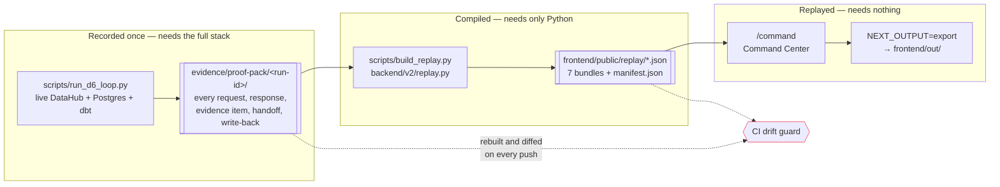

Four properties make this trustworthy rather than merely convenient:

| Property | How it is enforced |
|---|---|
| **Bundles cannot drift from their source** | CI rebuilds every bundle and diffs it against what is committed. `built_at` is excluded — it is per-build provenance, so comparing it would fail on every push regardless. |
| **A replay cannot be mistaken for a live run** | A `REPLAY OF RECORDED RUN — NOT LIVE` banner sits above the incident header and cannot be dismissed. |
| **Unmeasured values cannot render as zero** | The bundle carries a `missing` block with a reason per field; the UI renders `N/A` and the reason. |
| **A dead link is worse than no link** | `--datahub-url` is **off by default**, so bundles carry bare URNs unless the capture host is known to be reachable. |
| **The claim is checked in a browser, not asserted** | `make verify-replay-ui` drives the built static site and runs 14 checks. |

The bundles are committed rather than generated at deploy time, because the
published replay URL has to build on a static host with no Python toolchain.
That trades a drift risk for a deployment guarantee — and the drift risk is the
one CI can close, which is why it was the acceptable side of the trade.

`ablation`, `eval` and `security` packs are deliberately **excluded** from bundle
compilation: they are measurement sweeps and security demos, not single
incidents, and half-populating an incident view with them would be misleading.
They have their own renderings under [`examples/`](examples/).

---

## Evaluation

**Fault-injection suite** — 7 scripted faults, each really injected into a real PostgreSQL, each followed by a real `dbt build`, each classified from real output, each reverted afterwards.

| | |
|---|---|
| Accuracy | **7/7 = 100.0%** |
| False-positive rate | **0/2 = 0.0%** |
| False negatives | 0 |
| Faults producing any runtime signal | 5/7 |

```bash
make eval    # requires the substrate PostgreSQL
```

**Read the headline number with its caveat.** 7/7 on 7 hand-written faults, scored by a classifier written in the same repository, is not evidence that DevGuard diagnoses arbitrary incidents — the fault set and the pattern set share an author. The two results that carry real weight are elsewhere in the table:

- **`control_no_fault`** — real database activity, no real fault. DevGuard answered `INSUFFICIENT_EVIDENCE`. A system that invents a root cause when nothing is wrong is worse than one that detects nothing.
- **`silent_value_drift`** — every `amount_cents` multiplied by 100. Every model builds, every test passes, and every downstream number is wrong by two orders of magnitude. DevGuard answered `INSUFFICIENT_EVIDENCE`, which is correct *and* a real limitation: it has no distribution check wired in, so it genuinely cannot see this class of fault.

Full per-fault results, classifier design and isolation strategy: **[examples/eval/](examples/eval/)**.

---

## Benchmarks

**Retrieval ablation** — does retrieving prior runbooks reduce time-to-root-cause? Same incident, same asset, two arms (`retrieval=on` / `off`), N = 5 per arm, interleaved so machine load is shared rather than landing on whichever arm ran last.

| arm | n | TTRC median | post-detection median | MCP calls | docs retrieved |
|---|---|---|---|---|---|
| `retrieval=on` | 5 | 5.14 s | **1.98 s** | 8 | 5 |
| `retrieval=off` | 5 | 4.87 s | **1.85 s** | 6 | 0 |

Two timings are published because either alone misleads. `time-to-root-cause` includes detection — a real `dbt run` that varies by more than the effect being measured — and the two arms' ranges overlap heavily, so **the TTRC delta is not distinguishable from noise and should not be quoted as a result.** The signal is in post-detection time, where retrieval costs **+0.128 s** and **+2 MCP calls**, and adds 4 evidence items to the chain.

**What this measures is the cost of retrieval, not its benefit.** The benefit is mediated entirely by the Diagnostician, which could not reach an inference endpoint in the capture environment. The harness is complete; the same command on a machine with a working key produces the full comparison.

N = 5 per arm, one machine, one incident, one substrate — these figures characterise this setup and do not generalise.

Full results and per-run raw data: **[examples/ablation/](examples/ablation/)**.

---

## Examples

Everything a reviewer needs to judge output quality **without running anything**
is committed.

| Path | What is in it |
|---|---|
| [`evidence/proof-pack/`](evidence/proof-pack/) | **7 recorded loop runs**, plus [10 ablation runs](evidence/proof-pack/ablation/), the [fault-injection output](evidence/proof-pack/eval/) and the [security captures](evidence/proof-pack/security/). Each run holds every MCP request and response, evidence items, agent handoffs, write-back payloads and the returned URNs. |
| [`frontend/public/replay/`](frontend/public/replay/) | **7 replay bundles** built from those runs, plus a [`manifest.json`](frontend/public/replay/manifest.json) index — what the Command Center reads. CI fails if they drift from their source. |
| [`examples/eval/`](examples/eval/) | Fault-injection suite results, per-fault, including the negative control. |
| [`examples/ablation/`](examples/ablation/) | Retrieval on/off study, N=5 per arm, with raw per-run data. |
| [`evidence/d10/screenshots/`](evidence/d10/screenshots/) | Command Center captures of a completed loop and a refusal. |

The recorded runs are chosen to show the failure modes, not just the happy path:

| Run | What it demonstrates |
|---|---|
| `d6-loop-pass2` | A complete remediation with all five write-back artifacts landing |
| `d5-refusal` | The Diagnostician declining on the control fault and naming the missing evidence class |
| `d6-fail-the-fix` | A deliberately bad patch — **nothing is written back**, which is the point |
| `d6-dry-run` | The exact payloads that *would* be sent, sent nowhere |
| `d4-evidence-chain` | The evidence chain in isolation |

Open any of them in the Command Center with the run picker in the top right.

---

## Testing

**1096 tests, 54 files, no API key, no collector, no network, no database.** That
constraint is not a convenience — it is what makes the suite a reviewer's tool
rather than the author's. CI runs it on every push in exactly the state a clean
clone is in.

Note what that means for the DataHub work: the **live** verification in
[`evidence/datahub-live/`](evidence/datahub-live/) needs a running catalog, but
every test that *consumes* its output does not. The proof packs are committed, so
[`test_replay_catalog_surface.py`](tests/test_replay_catalog_surface.py) can assert
that no agent ever called a tool the server did not offer — on a machine with no
DataHub at all.

```bash
make test          # the whole suite
python -m pytest tests/test_agent_allowlists.py -v    # one area
```

| Area | What it pins down | Tests |
|---|---|---|
| **Scanner pipeline** | Reflection-loop convergence, language routing, hostile ZIP/repo input, response contracts, cache round-trip, state eviction, failure diagnosis surfacing | **196** |
| **DataHub integration** | MCP tool contract, paginated cycle-safe lineage, ML-model impact, assertion corroboration, write-back rules and idempotency, preflight states, mutation scoping, negotiated capability surface | **209** |
| **Evaluation, replay & doc integrity** | Replay-bundle compilation, judging-matrix paths and figures, fault-injection scoring, ablation harness, upstream-claim honesty | **187** |
| **Security** | Least-privilege claims, API-key auth, Sentinel fencing, prompt-injection boundary, proof-pack redaction, rate limiting, hash-chained audit | **178** |
| **Observability & resilience** | Telemetry fail-safe, circuit breaker, fallback, cost accounting, adaptive routing floor, measured-vs-synthetic provenance | **152** |
| **Agents, evidence & governance** | Per-agent tool allowlists, evidence typing and chain rule, structural refusal, runtime evidence, approval gate | **137** |

Several of these are unusual enough to call out, because they test **honesty
properties** rather than behaviour — a category most suites do not have:

| Test | The property it defends |
|---|---|
| [`test_judging_matrix.py`](tests/test_judging_matrix.py) (56) | The submission document cannot cite a path that does not resolve or a test count larger than the suite. It also fails if the *Honest limits* section is ever deleted — so the document cannot quietly become marketing. |
| [`test_upstream_claims.py`](tests/test_upstream_claims.py) (13) | Fails if an upstream filing checkbox is ticked while the finding is not actually filed. |
| [`test_measured_error_rate.py`](tests/test_measured_error_rate.py) (21) | An unmeasured value must render `N/A` with a reason; it may not become a plausible zero. |
| [`test_least_privilege_claims.py`](tests/test_least_privilege_claims.py) (7) | The docs may not claim more privilege denials than the committed artifact proves. This test exists because the docs once claimed seven and the artifact showed four. |
| [`test_god_mode_provenance.py`](tests/test_god_mode_provenance.py) (10) | A payload mixing measured and synthetic fields must badge `partial` — never `live`. |
| [`test_replay_catalog_surface.py`](tests/test_replay_catalog_surface.py) (20) | The negotiated tool list shown in the UI must come from the server's own handshake, never a hard-coded fallback — otherwise a run that degraded to six tools would render an identical panel to one that got eight. A pack with no handshake must report `offered_count: null`, because `0` would claim the server offered nothing. |
| [`test_replay_bundle.py`](tests/test_replay_bundle.py) (48) | What the UI renders and what is on disk cannot diverge. |

To regenerate the per-area figures after adding tests:

```bash
python -m pytest tests/ --collect-only -q | grep -E '^tests/.*: [0-9]+$'
```

---

## Reproducibility

Everything below runs on a clean clone with **no API key, no catalog, no collector and no network**:

```bash
make doctor              # what is present, what is missing, what to do about it
make test                # 1096 tests
make replay              # replay bundles from the committed proof packs
make replay-build        # static export of the Command Center
make verify-replay-ui    # drive the built site in a real browser and assert
python scripts/verify_otel.py    # boot the real app, assert decoded OTLP
make scan-secrets        # secret scan over every tracked file
make verify              # everything CI runs, locally
```

The suites that need infrastructure name it explicitly:

| Command | Needs |
|---|---|
| `make eval` | substrate PostgreSQL |
| `make ablation` | substrate + DataHub + a catalog token |
| `scripts/verify_signoz.sh` | a running SigNoz |
| `scripts/verify_least_privilege.py` | DataHub with metadata service auth enabled |

Details and expected output: **[docs/REPRODUCIBILITY.md](docs/REPRODUCIBILITY.md)**.

---

## Project structure

```
DevGuard-Enterprise/
├── backend/
│   ├── api/                 FastAPI routers
│   ├── core/                pipeline, telemetry, resilience, audit, RAG, benchmark
│   └── v2/
│       ├── agents/          the nine agents
│       ├── datahub_client.py    MCP client and allowlist enforcement
│       ├── datahub_preflight.py detect + validate config before a run needs it
│       ├── assertions.py    dbt assertions read as recovery corroboration
│       ├── ml_impact.py     the mlModel at the end of the blast radius
│       ├── evidence.py      typed evidence and chain validation
│       ├── handoff.py       inter-agent handoff contract
│       ├── proofpack.py     proof-pack writer
│       ├── replay.py        proof pack to replay bundle
│       ├── sentinel.py      prompt-injection boundary
│       ├── faults.py        fault injection
│       └── ablation.py      ablation harness
├── frontend/
│   ├── app/command/         Command Center (replay UI)
│   ├── app/scanner/         scanner UI
│   ├── app/nexus/           operations panels
│   └── components/command/  the twelve Command Center panels
├── evidence/
│   ├── proof-pack/          one directory per recorded run
│   ├── datahub-live/        DataHub v1.7.0: capability matrix, auth A/B, config
│   └── d0 … d10/            the v1.6.0-era capture trail
├── examples/                ablation study, evaluation results
├── tests/                   1096 tests
├── scripts/
│   ├── verify_datahub_capabilities.py   probe every capability, four statuses
│   ├── verify_least_privilege.py        ALLOW/DENY proof; refuses if auth is off
│   ├── capture_datahub_screenshots.py   drive the real UI, record every attempt
│   ├── provision_catalog.py             the domain + tag vocabulary DevGuard writes into
│   ├── setup_service_account.py         the least-privilege account and its policies
│   ├── run_d6_loop.py                   the full incident loop, end to end
│   └── build_replay.py                  proof packs to replay bundles
├── substrate/               PostgreSQL seed, dbt project, ML model + registration
├── recipes/                 DataHub ingestion: postgres, dbt, glossary, properties
├── signoz/                  dashboard, alert rules, deployment
├── docs/
│   ├── screenshots/datahub/         23 captures of the live instance
│   ├── screenshots/command-center/  the replay UI rendering the live run
│   ├── screenshots/signoz/          telemetry, dashboard, alert rules
│   └── upstream/                    findings prepared for DataHub
└── .github/workflows/       CI
```

---

## Deployment

| Component | Recommended | Notes |
|---|---|---|
| Backend | Railway / Render | Container or buildpack; `backend.main:app` |
| Frontend | Vercel | Static export also supported for the replay UI |
| Catalog | DataHub Core | Metadata service auth **must** be enabled — see [Security model](#security-model) |
| Observability | Self-hosted SigNoz | `signoz/deploy/` compose files included |
| Substrate | `substrate/docker-compose.yml` | PostgreSQL for the demonstration dataset |

Container images are defined by `backend/Dockerfile` and `frontend/Dockerfile`; `docker-compose.yml` wires the local stack. Step-by-step instructions: **[DEPLOYMENT.md](DEPLOYMENT.md)**.

### Deployment architecture

The topology follows the same split the replay system does: **the flagship module
has no runtime dependency at all**, so it deploys as static files, and everything
that needs a backend degrades independently of it.

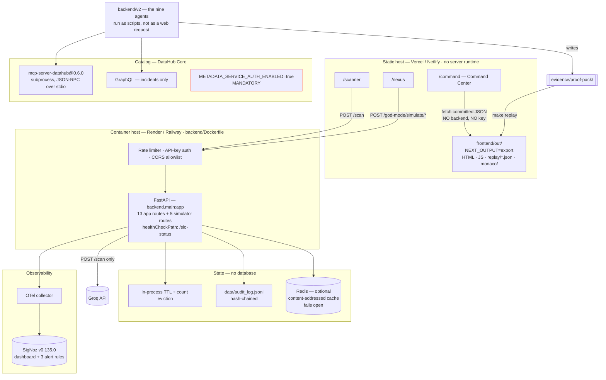

Three things in that picture are load-bearing and easy to miss:

| | Why it matters |
|---|---|
| **The agent loop is not a web endpoint.** | `backend/v2` runs as scripts (`scripts/run_d6_loop.py`), writing proof packs. It is not reachable over HTTP, so no request can trigger a catalog mutation. |
| **There is no database.** | State is in-process with eviction, an append-only hash-chained JSONL audit log, optional Redis that fails open, and committed JSON evidence. Correct for this scope, and named as the largest production gap in [the architecture review](docs/ARCHITECTURE_REVIEW.md). |
| **`METADATA_SERVICE_AUTH_ENABLED=true` is mandatory.** | The DataHub quickstart ships it `false`, under which Access Policies are **not enforced at all** and every least-privilege check silently passes. See [Security model](#security-model). |

Deployment configuration is committed and resolved, not described:
[`render.yaml`](render.yaml) · [`vercel.json`](vercel.json) ·
[`netlify.toml`](netlify.toml) · [`docker-compose.yml`](docker-compose.yml) ·
[`otel-collector-config.yaml`](otel-collector-config.yaml) ·
[`versions.env`](versions.env).

---

## API overview

The backend is a FastAPI application. It **starts and serves every endpoint below
without an API key** — only `POST /scan` and its two siblings need one, and they
fail with a clear error rather than at import time.

```bash
python -m uvicorn backend.main:app --port 8000
```

Interactive schema at `/docs` (Swagger), `/redoc`, and `/openapi.json`.

| Group | Endpoints | Auth | Notes |
|---|---|---|---|
| **Scanning** | `POST /scan` · `POST /scan/zip` · `POST /scan/repository` | opt-in key **+ rate limited** | The three that spend real model calls. 20 req / 60 s per client by default. |
| **Scan lifecycle** | `GET /scan/{id}` · `GET /scan/project/{id}` | open | Short-lived handles — in-process state is evicted, not accumulated. The audit log is the durable record. |
| **Governance gate** | `POST /scan/{id}/approve` · `POST /scan/{id}/reject` | opt-in key | `critical` / `high` findings do not finalise without a decision, and the decision is written to the audit trail. |
| **Streaming** | `WS /ws/scan/{id}` | open | Span events, buffered per scan so a late client still receives what it missed. |
| **Audit** | `GET /audit-log` · `GET /audit-log/verify` | open | Hash-chained; `verify` recomputes the chain and names the first entry that fails. Runs in a worker thread so a large log cannot block the loop. |
| **Operations** | `GET /slo-status` · `GET /telemetry-status` · `GET /languages` | open | `/slo-status` answers **even when the collector is unreachable** — telemetry is fail-safe, and that is regression-tested. |
| **Simulators** | `POST /god-mode/simulate/{scenario}` ×5 | open | Drives the Nexus panels. Every response is badged with its real provenance. |

Four conventions run across the whole surface and are worth knowing before
reading any single endpoint:

- **Honest nulls.** A field that could not be measured is `null` with a reason beside it. The API never substitutes a plausible zero.
- **Provenance.** Anything that could come from more than one source carries `data_source`, and it is never `live` unless the value genuinely came from a live dependency.
- **Trace propagation.** Pass a W3C `traceparent` and it flows through the pipeline onto every child span.
- **Reads stay open in both auth modes**, deliberately: 401-ing or throttling a liveness probe is how a healthy service gets marked unhealthy.

Full request/response shapes, error semantics and every configuration variable:
**[docs/API.md](docs/API.md)**.

---

## Security model

Full detail in **[SECURITY.md](SECURITY.md)**. In summary:

**Untrusted-content boundary.** Everything read from the catalog or from build output is untrusted input. `backend/v2/sentinel.py` fences it before it reaches any prompt, and the boundary is regression-tested.

**Mutation allowlist**, enforced in the MCP client *before* the request is written to the pipe, on three axes:

| Axis | Value |
|---|---|
| Tools | `add_tags`, `update_description`, `save_document`, `add_structured_properties`, `add_owners` — held by **Scribe only** |
| Entity types | `dataset`, `document` |
| Scope | five named dataset URNs |

Reads are deliberately unrestricted — the blast radius of reading an asset DevGuard does not own is nil, and narrowing reads would break lineage traversal.

**Least privilege.** A dedicated service account (`urn:li:corpuser:devguard_agent`) holds exactly the privileges the five artifacts require. `DELETE_ENTITY`, `EDIT_LINEAGE`, `MANAGE_POLICIES`, `MANAGE_INGESTION`, `EDIT_ENTITY_GLOSSARY_TERMS`, `EDIT_DOMAINS_PRIVILEGE` and `EDIT_ENTITY_STATUS` are never granted. **All seven denial cases are now proven against a live server** — the glossary and domain probes, previously written but never executed, ran this session:

```
$ python scripts/verify_least_privilege.py
auth enforcement: ON — a forged token was rejected with HTTP 401

ALLOW: 5/5 behaved as required
DENY : 7/7 correctly refused
```

Artifact: [`evidence/datahub-live/03-least-privilege-AUTH-ON.txt`](evidence/datahub-live/03-least-privilege-AUTH-ON.txt).
`EDIT_ENTITY_STATUS` still has no probeable mutation in DataHub's GraphQL and is
therefore asserted rather than proven; per-privilege status is in
[SECURITY.md](SECURITY.md#least-privilege). Independently, the account's own
`me.platformPrivileges` reports `managePolicies`, `manageIngestion` and
`manageDomains` all `false`.

> **The prerequisite, and the trap inside it.** The DataHub quickstart still
> ships `METADATA_SERVICE_AUTH_ENABLED=false` as of **v1.7.0**, under which
> Access Policies are **not evaluated at all**. Enabling it is mandatory.
>
> The trap is worse than a test passing for the wrong reason. Every DENY probe is
> a real mutation — a soft-delete, a lineage edit, a policy creation — and the
> design rests on the server refusing them. With nothing enforcing, they are not
> refused: **they land.** Running the suite against a stock quickstart
> soft-deleted the hero dataset, added a cycle to its lineage, and left behind a
> policy granting the agent `MANAGE_POLICIES`, while correctly reporting the deny
> half as failed. The report was accurate and the damage was already done.
>
> So the verifier now **fails closed**. It asks the server whether auth is
> enforced by presenting a forged token — a server that accepts one is not
> checking — and refuses to run otherwise, naming the fix rather than offering a
> flag that sounds harmless. The override is spelled
> `--i-understand-the-deny-probes-will-mutate` and exists only to reproduce the
> demonstration. `auth_enforced` is written into the summary artifact too,
> because a DENY row reading "refused" means nothing if nothing was checking.
> Both runs are kept: [auth off](evidence/datahub-live/02-least-privilege-AUTH-OFF.txt) ·
> [auth on](evidence/datahub-live/03-least-privilege-AUTH-ON.txt).

**Vocabulary is an operator responsibility, not the agent's.** The Scribe applies
the `devguard_incident_impacted` tag and deliberately will **not** create it —
`add_tags` against an unknown tag URN fails, and an agent that can invent
vocabulary can invent meaning. The tag is declared in
[`scripts/provision_catalog.py`](scripts/provision_catalog.py) and applied once at
provisioning time. The first live run failed artifact 3 on exactly this, which is
how the gap was found; the same run also demonstrated the write-back's
partial-failure policy holding — the incident stayed **ACTIVE** rather than
asserting a verified state whose supporting knowledge was missing.

**Autonomy policy.** The published table and the enforced policy are the same object in code, so they cannot drift:

| Risk | Allowed action | Who approves |
|---|---|---|
| LOW / MEDIUM / HIGH | propose + validate; apply only after approval | asset owner, resolved from the graph |
| CRITICAL | nothing applied; recorded and escalated | **nobody — no approval path exists** |

Nothing is autonomous in this build. A module-level assertion enforces it, and `ApprovalRequest.approve()` raises `PermissionError` for CRITICAL, so no identity can authorise destructive DDL, a data mutation, a permission change or a hard-coded credential.

**Rate limiting on the endpoints that spend money.** `POST /scan`, `/scan/zip` and `/scan/repository` each cost real model calls — a project scan is that multiplied by up to 25 files — so each is guarded by a per-client fixed window (`backend/core/ratelimit.py`), 20 requests per 60 s by default, configurable through `DEVGUARD_SCAN_RATE_LIMIT` and `DEVGUARD_SCAN_RATE_WINDOW_S`, with `0` disabling it for local work. A refusal returns `429` with `Retry-After`. Read endpoints are deliberately exempt: rate-limiting `/slo-status` is how a service gets marked unhealthy for being polled. The limiter is **per process** — behind N replicas the effective ceiling is N×, which is documented rather than solved, because moving the counter into the optional fail-open cache would trade a wallet risk for an availability risk.

**CORS.** Origins come from `DEVGUARD_ALLOWED_ORIGINS` (comma-separated); the default remains `*` so a clean clone still works without configuration. Deployments that pair a known frontend with the backend should set it.

**Secret hygiene.** No credential is committed. `scripts/scan_secrets.py` runs in CI over the working tree, and a separate CI job scans the full git history — a secret in an old commit still counts.

**Authentication, opt-in.** The rate limiter is a *cost* guard, not a security control — it keys on `X-Forwarded-For`, which a direct caller can forge — so the scan endpoints also accept a shared secret. Set `DEVGUARD_API_KEYS` to a comma-separated list and `POST /scan`, `/scan/zip` and `/scan/repository` require `Authorization: Bearer <key>` or `X-API-Key: <key>`; leave it unset and behaviour is exactly what it was, because a clean clone has to run with no configuration. Keys are compared with `secrets.compare_digest`, keys shorter than 16 characters are refused at load (a 4-character key reads as protection without being any), and the check runs *before* the rate limiter so anonymous traffic cannot burn a real caller's allowance. `GET /slo-status` reports which mode is live and the SHA-256 fingerprints of the loaded keys — a deployment that believes it is protected but is not is worse than one that knows it is open.

> This is a shared secret, not an identity system: no users, no scopes, no rotation, no expiry. It is the right size for keeping strangers out of a paid inference endpoint and the wrong size for multi-tenant access control. Put a real IdP in front if you need one.

---

## Limitations

Stated plainly, because a claim a reviewer can disprove costs more than the feature was worth.

- **Model-dependent diagnosis is unmeasured.** The Diagnostician could not reach an inference endpoint in the capture environment, so every recorded run derives its root cause deterministically from runtime evidence. The refusal path, the evidence rule and the chain validation are all proven; the *quality of model reasoning* is not.
- **The ablation measures retrieval's cost, not its benefit**, for the same reason. See [Benchmarks](#benchmarks).
- **Silent data corruption is out of scope.** There is no distribution or range check, so value drift that leaves every model building and every test passing is invisible. The evaluation suite includes this case precisely so the gap is on the record.
- **SigNoz verification is complete except for one step.** The stack, a stored distributed trace, the dashboard and the alert rules are all proven against a running SigNoz v0.135.0. What is not yet proven is the full agent chain in a single trace, which needs a completed model-backed run.
- **The SigNoz MCP path is designed, not demonstrated.** `backend/core/mcp_client.py` provides a fail-safe interface for querying SigNoz telemetry, but it has never completed a round trip against a real MCP server; it assumes an HTTP envelope where real MCP is JSON-RPC. When unavailable, cost queries fall back to an in-process estimate reported as `data_source: "local_shadow"` — never as live telemetry. Rationale and remaining work: [docs/MCP_DECISION.md](docs/MCP_DECISION.md).
- **The scanner's accuracy benchmark has never been run to an artifact**, so no accuracy figure is published anywhere. The UI shows "accuracy not measured" until one exists, and that artifact is the only route by which a number can reach the API or the UI.
- **Container images are defined but not built end to end** in the capture environment, whose egress policy blocks the Debian and PyPI mirrors the builds need. Run the backend and frontend directly if you hit the same.
- **The RAG store falls back to lexical overlap.** The pinned `chromadb` and `sentence-transformers` backends are not importable in this environment; retrieval remains deterministic and relevant but is not semantic.
- **Freshness and usage statistics are empty, and cannot be filled here.** Both DataHub APIs are present and answer cleanly — they are `PRESENT_NO_DATA` in the [capability matrix](evidence/datahub-live/CAPABILITY_MATRIX.md), not `ABSENT` — but both need a connector that can read a warehouse's own query history. Snowflake, BigQuery and Redshift emit it; DataHub's Postgres source does not, and this substrate is Postgres. Nothing in DevGuard reasons about freshness as a result.
- **DataHub OSS cannot be *told* an assertion passed.** Assertions are ingested and read: 13 dbt tests are first-class `Assertion` entities and the Referee corroborates recovery against them. But there is no `reportAssertionResult` mutation in OSS, so DevGuard can never author an assertion result of its own. The corroboration is genuinely one-directional.
- **The live verification ran against a single-node quickstart, not a cluster.** OpenSearch reports `yellow` throughout because replica shards cannot be assigned on one node, and the disk watermarks had to be calibrated to absolute sizes rather than percentages ([why](DEPLOYMENT.md)). Nothing about horizontal scale, upgrade paths or multi-tenant behaviour was tested.
- **One screenshot gap is closed and worth recording as such.** This list previously said there was no post-write-back catalog capture. There now are five, in [`docs/screenshots/datahub/`](docs/screenshots/datahub/), showing the incident, the column annotation, the structured properties, the governance tab and the dataset overview after a completed run.

---

## FAQ

**Do I need a DataHub instance to try this?**
No. The Command Center replays committed proof packs with no catalog, no
database, no backend and no API key — `cd frontend && npm ci && npm run dev`,
then open `/command`. A live catalog is only needed to run the loop yourself.

**Do I need an API key?**
Only for `POST /scan` and the ZIP/repository scans, which call a model. Every
other surface — the Command Center, Nexus, the whole test suite, `make doctor`,
`make replay` — runs without one. CI runs with no key on purpose, because that
is the state a reviewer's machine is in on a clean clone.

**Is the Command Center showing live data?**
No, and it says so: a persistent `REPLAY OF RECORDED RUN — NOT LIVE` banner sits
above the incident header. The numbers are read out of proof packs committed to
this repository.

**Why does the Diagnostician say `REASONER_UNAVAILABLE` in the recorded runs?**
Because no model was reachable when they were recorded. All 49 handoff records
carry `model=null, tokens=0`. Those root causes were derived deterministically
from runtime evidence, and each artifact says so. The refusal path and the
evidence rule are proven; the quality of model reasoning is not.

**Why do costs and tokens show `N/A` instead of `0`?**
Because nothing was measured, and an unmeasured value is not a zero. A zero cost
would be a claim that inference was free.

**Is this multi-agent system just one prompt with nine names?**
Eight of the nine agents make no model call at all. Each has a tool allowlist
enforced in code before a request reaches the wire, and asserted in tests. The
Diagnostician — the only one that reasons — holds zero tools, so text injected
into a catalog description cannot cause a tool call.

**Why is 3D lineage / a chat interface / autonomous remediation not here?**
Deliberate. 2D lineage is more legible at video resolution and under
compression; a chatbot front door is an explicit anti-goal; and remediation
always passes through an owner-routed human gate. See [Limitations](#limitations).

**Can it scan my private repository?**
Not currently. Repository scanning accepts public `https://` URLs on a host
allowlist, and credentials in a URL are refused outright.

**Why does Nexus look empty when I open it?**
Panels render "No run yet" until a run returns real data — they never fill space
with sample figures. Press **Initiate God Mode** to run all five concurrently.

**Is the ablation a positive result?**
No. With retrieval on, the median time-to-root-cause was *slower*
(5.14 s vs 4.87 s over N=5 per arm). Both arms reached the root cause the same
way, so that delta is the **cost** of retrieval and says nothing about its
benefit. It is published because it was measured, not because it flatters.

---

## Troubleshooting

| Symptom | Cause | Fix |
|---|---|---|
| `Network error reaching the pipeline.` on Scanner | Nothing is listening on the API base | Start the backend: `python -m uvicorn backend.main:app --port 8000`. This message means the fetch itself threw, not that an endpoint is missing. |
| `DevGuard pipeline is unreachable. Retry in a moment.` | Backend is up, but the scan returned 5xx — usually a missing or rejected `GROQ_API_KEY` | Set `GROQ_API_KEY` in `.env`. Check the backend log for the underlying error. |
| Editor stuck on "Loading editor…" | Monaco failed to load | Monaco is served from this origin, staged into `public/monaco/` by the `prebuild` hook. If the folder is missing, run `npm ci` then `npm run build` — never `playwright install`-style CDN fetches. |
| `ModuleNotFoundError: No module named 'backend'` | Running pytest from the wrong directory or interpreter | Run from the repository root with the interpreter that installed `requirements.txt`: `python -m pytest`. |
| `AttributeError: '_IncludedRouter' object has no attribute 'path'` | `fastapi` was bumped past `0.136.0` without upgrading the OTel instrumentation | Keep the pin. The reasoning is written out at the top of [`requirements.txt`](requirements.txt). |
| Nexus panels stay on "No run yet" after pressing a button | Backend unreachable, or CORS blocked | Confirm `GET /slo-status` answers on the API base. These modules need no API key. |
| Repository scan rejected with "Host … is not allowed" | The SSRF allowlist | Only `https://` on github.com, gitlab.com, bitbucket.org or codeberg.org. This is a security boundary, not a config gap. |
| Replay bundles missing or stale | `frontend/public/replay/` not built | `make replay`. CI enforces that the committed bundles match the proof packs. |
| `make test` collects 0 tests | Dependencies not installed | `pip install -r requirements.txt`. `make doctor` names every missing prerequisite. |
| Traces absent from SigNoz | No collector reachable | Telemetry is fail-safe by design — a scan never depends on it. Verify with `python scripts/verify_otel.py`. |

`make doctor` is the first thing to run when something is wrong: it reports what
is present, what is missing, and what each missing piece disables.

---

## Roadmap

- Complete the SigNoz MCP round trip over JSON-RPC, promoting self-observation from `local_shadow` to live telemetry
- Capture the full nine-agent chain in a single SigNoz trace with a model-backed run
- Distribution and range checks, to make silent value drift detectable rather than correctly refused
- Broaden the evaluation suite beyond author-written faults, ideally against replayed real incidents
- Publish the scanner accuracy benchmark once a model-backed run produces the artifact
- Domain-scoped rather than URN-scoped mutation policies, once the substrate has domains worth scoping to

---

## Contributing

Issues and pull requests are welcome. Please read [CONTRIBUTING.md](CONTRIBUTING.md) for the development setup and the checks that must pass, and [CODE_OF_CONDUCT.md](CODE_OF_CONDUCT.md) for community expectations.

---

## AI-assisted development

AI coding assistants were used as an engineering productivity tool during development, in the same category as an IDE or a linter. All architecture, implementation decisions, testing, validation and final verification were reviewed by the project author, who is responsible for the contents of this repository.

Full component attribution — what was authored in-window versus carried over, and what the evidence does and does not show — is in **[DISCLOSURE.md](DISCLOSURE.md)**.

---

## Acknowledgements

- **[DataHub](https://datahubproject.io/)** — the metadata platform this project is built on, and its MCP server, which made agent-facing catalog access practical.
- **[SigNoz](https://signoz.io/)** — open-source observability; the dashboard and alert rules here are built against a self-hosted deployment.
- **[OpenTelemetry](https://opentelemetry.io/)** — vendor-neutral instrumentation throughout.
- **[dbt](https://www.getdbt.com/)** — the transformation layer of the demonstration substrate.
- **[Groq](https://groq.com/)** — inference for the model-backed agents.

---

## References

The external specifications and projects this implementation is built against.
Versions are pinned in [`versions.env`](versions.env) and resolved, not floating.

| Reference | Used for |
|---|---|
| [DataHub](https://datahubproject.io/) · [docs](https://docs.datahub.com/) | The metadata platform. Column-level lineage, entities, incidents, documents, structured properties, ownership. |
| [`mcp-server-datahub`](https://github.com/acryldata/mcp-server-datahub) | The official MCP server. Its published tool list is transcribed into [`backend/v2/mcp_contract.py`](backend/v2/mcp_contract.py) and asserted offline. |
| [Model Context Protocol](https://modelcontextprotocol.io/) · [spec](https://spec.modelcontextprotocol.io/) | JSON-RPC 2.0 over stdio — the real handshake, captured in [`evidence/d0/`](evidence/d0/). |
| [OpenTelemetry](https://opentelemetry.io/) | Traces, metrics and logs over OTLP/gRPC, plus the logging bridge for log-to-trace correlation. |
| [SigNoz](https://signoz.io/) | Trace storage and alerting. Dashboard and rules ship in [`signoz/`](signoz/). |
| [Groq](https://groq.com/) | Inference for the one model-backed agent and the Scanner pipeline. |
| [dbt](https://www.getdbt.com/) | The transformation layer of the demonstration substrate. |
| [FastAPI](https://fastapi.tiangolo.com/) · [Next.js](https://nextjs.org/) | Backend and frontend frameworks. |
| [Keep a Changelog](https://keepachangelog.com/en/1.1.0/) · [Semantic Versioning](https://semver.org/spec/v2.0.0.html) | The form [CHANGELOG.md](CHANGELOG.md) follows. |
| [Contributor Covenant](https://www.contributor-covenant.org/) | The basis of [CODE_OF_CONDUCT.md](CODE_OF_CONDUCT.md). |
| [CWE](https://cwe.mitre.org/) | The weakness taxonomy the Code Scanner classifies against. |

---

## License

Apache-2.0 — see [LICENSE](LICENSE).
