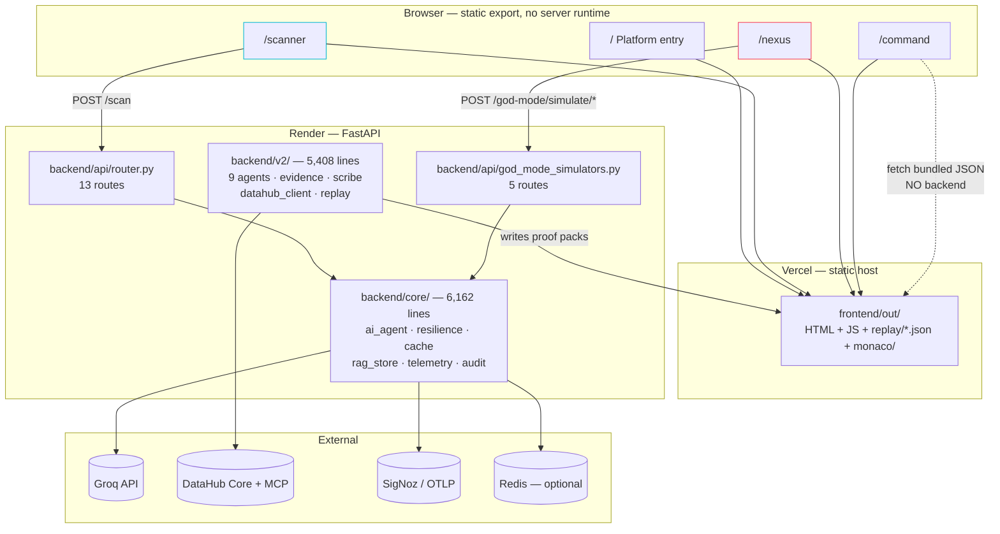
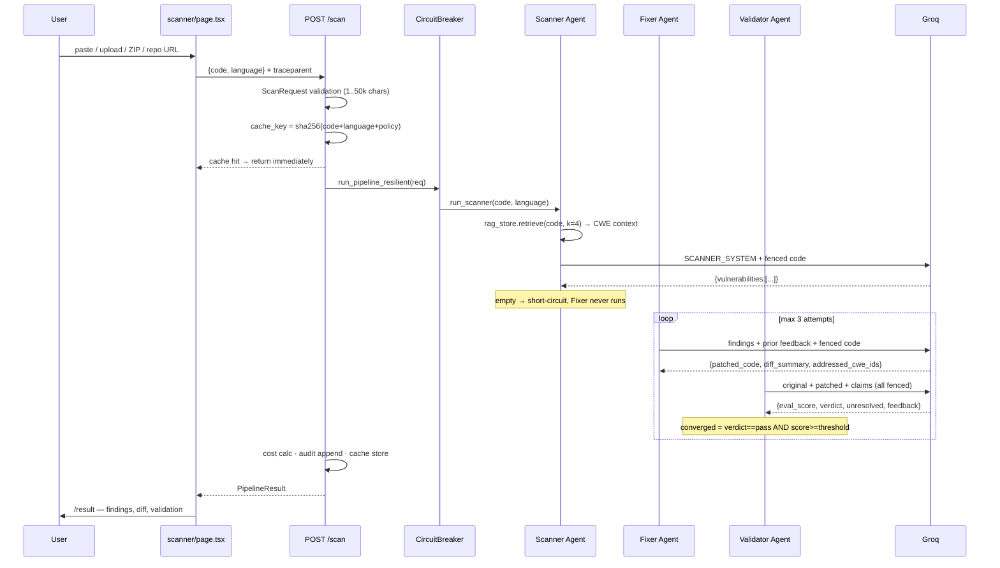
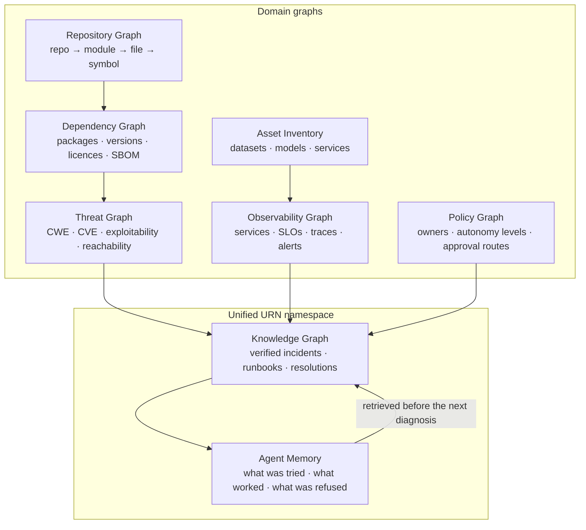

# DevGuard — 360° Architectural Review

**Reviewed at:** `d4759ff` · **Method:** reverse-engineered from source, not from documentation. Every claim below is traceable to a file and line. Where the code and the docs disagree, the code wins and the disagreement is called out.

**Scale:** 25,596 lines of Python across 94 files · 8,729 lines of TypeScript across 30 files · 861 tests.

---

## 1 · Overall architecture

DevGuard is one repository containing **three products that share one backend and one evidence philosophy**, not one product with three screens. The three have genuinely different maturity, and conflating them is the single most common misreading of this codebase.

| Module | Route | Backend dependency | Maturity |
|---|---|---|---|
| **Enterprise** | `/command` | none at runtime — replays committed JSON | Deepest. The reason the project exists. |
| **Code Scanner** | `/scanner` | FastAPI + Groq | Real pipeline, real LLM, real reflection loop |
| **Nexus** | `/nexus` | FastAPI only | Thin. Mostly synthetic, honestly labelled. |



**The load-bearing architectural decision** is that `/command` reads committed JSON produced by `scripts/build_replay.py` from `evidence/proof-pack/`. It needs no backend, no catalog, no key, no database. That is why the flagship module is the only one that works on the public deployment today — and it is a genuinely good decision, not a compromise.

**Storage.** There is no database. State lives in: in-process dicts with TTL+count eviction (`_scan_results`, `_project_scans` in `router.py`), optional Redis (content-addressed cache, fails open), a hash-chained JSONL audit log (`data/audit_log.jsonl`), and committed JSON evidence. For a demo this is correct; for production it is the single biggest gap (§10).

---

## 2 · Scanner — every step



**Four input paths, one contract.** Paste and file-upload both become `code` in the browser and ride `POST /scan` — no upload endpoint. ZIP (`POST /scan/zip`) and repository (`POST /scan/repository`) collect N files server-side and run the *same* `run_pipeline_resilient` per file, capped at 25.

**Details that matter and are easy to miss:**

- **The Validator is adversarial by construction.** `VALIDATOR_SYSTEM` instructs "You are SKEPTICAL by default… find reasons the fix is inadequate." Convergence requires *both* a `pass` verdict and a score threshold — a high score with a `fail` verdict does not converge (`test_pipeline_loop.py` pins this).
- **Clean code short-circuits.** No findings → Fixer and Validator never run, and `final_validation` stays `None` rather than inventing a score.
- **Untrusted-content fencing** is applied to all code entering prompts (`backend/core/untrusted.py`), inherited from the Enterprise security model.
- **Language reaches all three prompts** and is part of the cache key, so identical bytes scanned as Java and Python are two distinct scans.

**Weakest link:** the Scanner's quality rests on retrieval, and retrieval is currently the `lexical-overlap-fallback[NOT-PROD]` embedder (§10).

---

## 3 · Nexus — five modules

All five are `POST /god-mode/simulate/*`, all return in <100 ms, none needs an API key.

| Code | Module | Purpose | Input | Output | Real or synthetic |
|---|---|---|---|---|---|
| **MOD-01** | Omni-Heal | Runs Scanner→Fixer→Validator as one commandable unit | `code` (optional) | diff, CWEs, validation | **`live` if `code` given — otherwise `synthetic`** |
| **MOD-02** | FinOps Agent | LLM spend trend → OTel sampling recommendation | none | budget, trend, recommendation | `live` (SigNoz MCP) / `local_shadow` / `synthetic` |
| **MOD-03** | Pre-Cog Ops | Extrapolates error-rate + memory drift over 15 min | none | forecast, autoscale recommendation | **`partial`** — RSS is real, error rate synthetic |
| **MOD-04** | Truth Serum | Cross-examines Scanner findings for hallucination | `code`, `cwe_id` | per-finding confidence verdicts | `live` with input, else `synthetic` |
| **MOD-05** | Executive Commander | Rolls up the other four into one brief | none | incident digest | `partial` — aggregated via `_rollup_data_source` |

**The most important finding in this section:** MOD-01 and MOD-04 accept a `code` parameter and will run the **real pipeline** when given one — `execute_omni_heal(code)` calls `run_pipeline()`, the same function `/scan` uses. **The UI never sends it.** `nexus/page.tsx` posts `{}` to every endpoint, so every module renders its synthetic branch.

That is a ~10-line frontend change away from making two of five modules genuinely live, and it is the highest-leverage improvement available anywhere in this repository.

**Honesty machinery worth crediting.** `_current_rss_mb()` reads `/proc/self/statm` — a real measurement replacing what the comments record as a former `random.uniform(160, 260)`. `_aggregate_source()` ranks provenance (`live=3, local_shadow=2, synthetic=0`) and reports the *weakest* component, so a payload mixing real and synthetic is badged `partial`, never `live`. The badge taxonomy (`Live / Local / Partial / Simulated / Unlabelled`) is computed from the response, not chosen by the UI.

---

## 4 · DataHub

**What it stores today** — five write-back artifacts, produced by the Scribe, the only agent holding mutation tools:

| # | Artifact | Mechanism |
|---|---|---|
| 1 | Incident raised → resolved | GraphQL `raiseIncident` / `updateIncidentStatus` |
| 2 | Post-mortem runbook | `save_document` (Context Document) |
| 3 | Column-level tag + description | `add_tags` / `update_description` on the schema field |
| 4 | Structured incident facts | `add_structured_properties` |
| 5 | Ownership signal | `add_owners` |

**Flow.** Read: `search` → `get_entities` → `list_schema_fields` → `get_lineage` (column-level) → `get_lineage_paths_between` → `get_dataset_queries`. Write: only after `Referee` returns recovery-verified. Transport is MCP over JSON-RPC 2.0 stdio via `uvx mcp-server-datahub@0.6.0` — a subprocess, not HTTP.

**Three guarantees enforced in code, not prose:**
- **Idempotency** keyed `(incident_id, artifact_type, target_urn)`, check-then-write, outcome recorded as `written | already_present | failed`.
- **All-or-nothing resolve** — `_resolve_incident()` runs last and is skipped if any knowledge artifact failed, so the graph never asserts a verified state that does not exist.
- **Mutation scope check** — `check_mutation_scope()` runs before every call; `TOOLS_IS_MUTATION_ENABLED` is off unless explicitly enabled.

**Missing enterprise capabilities:** no incremental/streaming ingestion, no schema-registry integration, no data-contract enforcement, no cross-catalog federation, no write-back rollback (documented honestly — DataHub incidents resolve, they do not delete), no multi-tenant scoping beyond one service account, no backfill of historical incidents.

---

## 5 · AI agents

Two separate rosters. **They are different components and the naming collides.**

**Enterprise (9 agents, `backend/v2/agents/`):** Watcher → Cartographer → Archivist → Pathfinder → Diagnostician → Surgeon → Referee → Magistrate → Scribe.

**Eight of the nine make no model call.** Only the Diagnostician does, and it holds **zero tools**. That is the security architecture: text injected into a catalog description cannot cause a tool call, because the only agent that reads reasoning-critical text cannot act. The Scribe is the only writer, and only post-verification.

**Scanner (3 agents, `backend/core/ai_agent.py`):** Scanner → Fixer → Validator, all three model-backed, bounded at 3 reflection attempts.

> **Naming collision:** Enterprise's `referee` displays as "Validator" and Scanner has its own Validator. Different scope, different code, different lifecycle. The canonical contract also names 11–12 agents (Strategist, Patchsmith, Governor, Commander) against 9 shipped — an unreconciled roster discrepancy that a careful reviewer will notice.

**Nexus "agents"** (Truth Serum, FinOps, Pre-Cog, Executive Commander) are orchestrator *functions* in `god_mode_orchestrator.py`, not agents with tool allowlists. Calling them agents is the most generous framing in the project.

**Interaction model.** Enterprise agents communicate exclusively through typed `AgentHandoff` envelopes carrying evidence **IDs, never free text** — rationale is display-only and explicitly never an instruction. Allowlists are enforced in code and asserted in `test_agent_allowlists.py` (18 tests).

---

## 6 · Backend

FastAPI + uvicorn, async throughout. **18 routes** (13 core + 5 Nexus), no database, no ORM, no background worker.

```
backend/
  main.py                    lifespan: telemetry init → logging bridge → cache
  api/router.py     1,068 L  13 routes + in-process job store with TTL eviction
  api/god_mode_…      136 L  5 Nexus routes, thin delegation
  core/
    ai_agent.py       974 L  Scanner/Fixer/Validator + _call_llm choke point
    resilience.py     487 L  CircuitBreaker(fail_max=5, reset=30s) + fallback model
    telemetry.py      729 L  OTel init, @traced, cost, redaction
    rag_store.py      414 L  16 CWEs, chromadb→memory, ST→lexical fallback
    schemas.py        382 L  every cross-boundary type
    cache.py          202 L  content-addressed Redis, fails open
    project_scan.py   ~500 L ZIP/repo collection + security boundaries
  v2/               5,408 L  Enterprise: 9 agents, evidence, replay
```

**Execution flow:** `POST /scan` → validate → cache lookup → `run_pipeline_resilient` → breaker → `run_pipeline` → agents → `_call_llm` → Groq → cost calc → audit append → cache store → response.

**`_call_llm` is the single choke point** for every model call across all agents — one place for retries, cost recording, token accounting and error normalisation. This is good design and makes the system auditable.

**Model routing** is severity-based (`MODEL_STRONG` = `llama-3.3-70b-versatile`, `MODEL_CHEAP` = `llama-3.1-8b-instant`), overridable via `PRIMARY_MODEL`/`FALLBACK_MODEL` env vars, with a self-observation layer that can downgrade the Fixer under cost pressure but **never the Scanner** — detection is deliberately never under-provisioned.

---

## 7 · Frontend

Next.js 16 App Router, TypeScript, Tailwind, Framer Motion, Monaco. **Static export** (`output: 'export'`) — no SSR, no server components doing data access, no API routes. Every backend call originates in the visitor's browser.

| Page | Lines | State | Backend |
|---|---|---|---|
| `/` | ~950 | boot sequence, transition | `/slo-status` (degrades to offline) |
| `/scanner` | ~700 | snippet/project mode, language, file | `/scan`, `/scan/zip`, `/scan/repository`, WS |
| `/nexus` | ~810 | 5 module result slots | 5 × `/god-mode/simulate/*` |
| `/command` | ~200 | replay bundle + run picker | **none** — bundled JSON |
| `/result` | ~880 | scan result | `/scan/{id}` |

**State is local `useState` only** — no Redux, no Zustand, no React Query. Correct for five pages; it would not survive a sixth with shared state.

**Component libraries:** `components/command/` (10 — `primitives.tsx` holds `Panel`, `Urn`, `Badge`, `Stat`, `NA`), `components/nexus/` (6 — `_shared.tsx` holds the data-source badge and value pickers), `components/scanner/` (1).

**Rendering discipline worth noting:** `NotAvailable` / `N/A` rendering is a first-class component, not a fallback string. The UI is architecturally incapable of showing a plausible zero for an unmeasured value — that is enforced by the component API.

**Monaco is self-hosted** from `public/monaco/` (staged by a `prebuild` hook), not the jsdelivr CDN. Without this the editor never mounts on a proxied or offline network.

---

## 8 · Observability

OpenTelemetry → OTLP/gRPC → SigNoz. **Traces, metrics and logs**, with a logging bridge injecting `trace_id`/`span_id` into stdlib log records so raw console output correlates before it reaches SigNoz.

**Trace flow:** the browser mints `traceparent` (`lib/otel-frontend.ts`) → `POST /scan` extracts it (`extract_context`) → the whole pipeline is one distributed trace → the WebSocket reuses the same trace id, so live progress lives under the same trace as the request.

**Instrumentation:** `@traced` decorator on every agent; `record_llm_observability` at the `_call_llm` choke point emits `devguard.llm.tokens_total`, `.cost_per_request`, `.cost_total`, `.cost_saved`.

**Circuit breaker:** `fail_max=5` consecutive failures → OPEN for 30 s → **degrades to a cheaper model rather than failing**, and the degraded path genuinely changes which model runs (a prior bug recorded the fallback model as a span attribute then discarded it, making "fallback" a retry in disguise).

**Fail-safe is the design rule:** telemetry never breaks a scan. Every exporter path is wrapped; a dead collector costs buffered spans and nothing else, verified by `test_telemetry_failsafe.py`.

**Health endpoints:** `/slo-status` (SLO window + breaker state — the real liveness probe), `/telemetry-status` (honest statement of what is actually on), `/audit-log/verify` (hash-chain integrity). **There is no `/health`**, and no `/health/platform` despite the contract specifying one.

---

## 9 · Security

**Genuinely strong, and unusual for a hackathon project:**

| Control | Implementation |
|---|---|
| Prompt-injection boundary | Catalog free-text is `UNTRUSTED_TEXT`, fenced in every prompt, never instruction |
| Structural refusal | Diagnostician holds zero tools — injected text cannot cause an action |
| Least privilege | Per-agent tool allowlists enforced pre-wire, asserted in 18 tests |
| Write gating | Only Scribe mutates; only post-verification; scope-checked per call |
| Zip slip | Entries with absolute paths or `..` rejected, not sanitised |
| Zip bombs | Uncompressed size checked from metadata *before* decompressing, re-checked after |
| Archived symlinks | Skipped — a link to `/etc/shadow` cannot make a scan read host files |
| SSRF | `https://` + host allowlist; `file://`, `git://`, localhost, RFC1918, cloud metadata all unreachable |
| Argument injection | `git` runs via argv, never a shell, credential prompts disabled |
| Secret redaction | Shared redactor covers Bearer, JWT, `gsk_` keys, `*_TOKEN`/`*_KEY` assignments |
| Audit integrity | Hash-chained JSONL, tamper-evident, verifiable via endpoint |
| CI enforcement | Secret scan over working tree **and full git history** on every push |

**Weak points, ranked:**

*Ranked as first written. Items 1–3 were addressed after this review; the original finding is kept alongside the resolution, because a review that quietly edits itself into agreement with the code is not a review.*

1. ~~**`allow_origins=["*"]`** — acceptable for a demo, wrong for production.~~ **Addressed:** `DEVGUARD_ALLOWED_ORIGINS` takes an allowlist; the default stays `*` so a clean clone still runs, and `render.yaml` pins the hosted backend to the real frontend origin.
2. ~~**No authentication or rate limiting on any endpoint.**~~ **Addressed, partly.** The three spending endpoints and both approval-gate endpoints now take an opt-in shared secret (`DEVGUARD_API_KEYS`, `backend/core/auth.py`), and the spending endpoints are rate limited per client (`backend/core/ratelimit.py`). Two caveats keep this from being a clean close: auth is **off unless configured**, so an internet-facing instance with no key set is still open, and reads — including `GET /audit-log` — stay unauthenticated by design.
3. ~~**No per-IP quota.**~~ **Addressed:** 20 requests / 60 s per client by default. The ZIP size cap was already enforced (25 MB total, 5,000 entries, 25 files).
4. **In-memory job state** — a restart loses scans; no distributed lock for multi-instance. **Open.** The rate limiter inherits this: its counter is per process, so N replicas means an effective ceiling of N×.
5. **`SECURITY.md` documents a threat model that exceeds what is enforced** in places. **Narrowed**, not closed — the deployment-posture section was rewritten against what the code now does.

**Production readiness: deployable behind a configured allowlist and a key; still single-instance.** The remaining blocker is state, not access control.

---

## 10 · Enterprise readiness — real vs simulated

| Capability | Status | Evidence |
|---|---|---|
| Evidence model + chain rule | **Real** | `evidence.py`, 20 tests, enforced in code |
| Tool allowlists | **Real** | Enforced pre-wire, 18 tests |
| Write-back idempotency + all-or-nothing | **Real** | `scribe.py`, 32 tests |
| Proof-pack capture + redaction | **Real** | 10 packs committed, 16 redaction tests |
| Replay (zero infrastructure) | **Real** | 8 bundles, CI drift guard, 14/14 UI checks |
| Scanner pipeline | **Real** | Genuine LLM loop, bounded reflection |
| Circuit breaker + fallback | **Real** | Verified to change the served model |
| OTel traces/metrics/logs | **Real** | Verified end to end via `verify_otel.py` |
| ZIP / repo scanning | **Real** | 59 tests incl. security boundaries |
| **Semantic retrieval** | **Broken → silently degraded** | `sentence-transformers 2.2.2` cannot import (huggingface_hub deadlock); `chromadb 0.4.24` fails on NumPy 2. Falls back to `lexical-overlap-fallback[NOT-PROD]` — the code's own name for it |
| **Recorded runs' LLM reasoning** | **Never exercised** | All 49 handoffs carry `model=null, tokens=0`; Diagnostician returns `REASONER_UNAVAILABLE` |
| Nexus MOD-02/03/05 | **Partial / synthetic** | Honestly badged |
| Nexus MOD-01/04 | **Capable but unwired** | Accept `code`; UI never sends it |
| Live DataHub in production | **Not deployed** | Replay only |
| Persistence | **Missing** | In-memory + JSONL |
| AuthN/AuthZ, rate limiting, multi-tenancy | **Missing** | — |
| `/health/platform` | **Missing** | Contract specifies it |

**The distinction that matters:** the *architecture* is real and the *governance machinery* is real. What has never been exercised is **model reasoning quality** — no recorded run in this repository invoked a model. The refusal path, the evidence rule and the chain validation are proven; the intelligence is not.

---

## 11 · Hackathon mapping

| Requirement | Status | Evidence |
|---|---|---|
| Genuine DataHub use | **Satisfied** | Read + 5-artifact write-back, real URNs committed |
| MCP / ACK / Skills (≥1) | **Satisfied** | `mcp-server-datahub@0.6.0` over stdio |
| Agents that do real work | **Satisfied** | Writes results back so the next run inherits them |
| Production ML Agents (secondary) | **Partial** | Dataset-level blast radius reaches the `mlModel`; column-level does not |
| Apache-2.0 licence | **Satisfied** | Detected by GitHub |
| Public repo | **Satisfied** | — |
| Zero-setup demo URL | **Satisfied** | Vercel static replay |
| Written description | **Satisfied** | README, 886 lines |
| **Demo video <3:00** | **Missing** | — |
| **Devpost submission** | **Missing** | — |
| Eligibility disclosure | **Satisfied** | `DISCLOSURE.md` |
| Reproducibility from clean clone | **Satisfied** | Verified; 861 tests, no key needed |
| Evaluation suite | **Satisfied** | 7/7 accuracy, 0 FP, control case, published |
| Ablation with N≥5 | **Satisfied, negative** | 5.14 s on vs 4.87 s off — reported honestly |
| **`make demo`** | **Missing** | No such target |
| **JUDGING_MATRIX / SUBMISSION_CHECKLIST** | **Missing** | — |
| **Journey + write-back GIFs** | **Missing** | T0 in the release contract |
| **Generated SVG diagram set** | **Missing** | Two inline Mermaid blocks only |

**Biggest scoring risk:** the submission package (video, Devpost, GIFs), not the engineering. Criterion 5 is scored on artifacts that do not exist.

---

## 12 · Gap analysis

| # | Current | Missing | Priority | Difficulty | Impact |
|---|---|---|---|---|---|
| 1 | Nexus posts `{}` | Send `code` to MOD-01/MOD-04 | **P0** | **Trivial** (~10 lines FE) | 2 of 5 modules become genuinely live |
| 2 | Backend not deployed | Deploy to Render; set `NEXT_PUBLIC_API_BASE` | **P0** | Low | Scanner + Nexus work in production |
| 3 | No demo video | Record <3:00 | **P0** | Medium | Directly scored |
| 4 | Broken semantic retrieval | Upgrade `sentence-transformers` ≥3 | **P1** | Low | Restores intended detection quality |
| 5 | No auth / rate limiting | API key + per-IP quota | **P1** | Medium | Blocks real production use |
| 6 | No LLM-exercised evidence | One recorded run with a live model | **P1** | Low | Removes the "never actually reasoned" objection |
| 7 | Roster 9 vs 11/12 | Reconcile or document | **P1** | Trivial | Judge-visible inconsistency |
| 8 | `allow_origins=["*"]` | Narrow to real origins | **P1** | Trivial | Security posture |
| 9 | No `make demo` | Add target | **P2** | Low | Contract requirement |
| 10 | No persistence | Postgres for scans/incidents | **P2** | High | Multi-instance, restart survival |
| 11 | No `/health/platform` | Aggregate dependency health | **P2** | Low | Contract requirement |
| 12 | Two Mermaid blocks | Generated SVG set | **P2** | Medium | Submission quality |
| 13 | In-memory job store | Redis-backed | **P3** | Medium | Horizontal scale |
| 14 | 16 CWEs | Broaden corpus | **P3** | Low | Detection breadth |

---

## 13 · Future DataHub — the enterprise design

Today DataHub is used as an **incident write-back target**. The evolution is to use it as the **substrate for organisational memory** — seven graphs sharing one URN namespace, so a query can traverse from a CVE to the deployment that carries it to the person accountable for it.



**Knowledge Graph** — verified incidents as first-class entities with resolution, time-to-root-cause and the evidence chain that justified them. Exists in embryo today (Context Documents); needs to become queryable structure rather than prose.

**Memory** — the loop that is currently one-directional. Today the Archivist retrieves prior runbooks. A real memory layer stores *attempts*, including failures and refusals, so the system learns which strategies did not work. This is the difference between a catalog and a colleague.

**Asset Inventory** — extend beyond datasets to services, models, endpoints and queues, each with an owner and a criticality tier.

**Repository Graph** — repo → module → file → symbol, linked to the datasets each file reads and writes. This is what makes "which code touches this column" answerable, and it is the natural home for the Scanner's findings, which today vanish after a response.

**Dependency Graph** — packages, versions, licences, SBOM. The joint with the Threat Graph is where "this CVE is reachable from production" becomes computable.

**Observability Graph** — services, SLOs, traces, alerts, tying SigNoz spans to catalog URNs so an incident carries its telemetry.

**Policy Graph** — owners, autonomy levels, approval routes, encoded rather than configured. The Magistrate reads this today from ownership; it should read a policy structure.

**Threat Graph** — CWE/CVE with exploitability and, critically, **reachability**: a vulnerability in unreachable code is not the same as one on a request path.

**The compounding property:** each graph is individually useful, but the value is in the joins. *"Which production ML models depend on a column touched by code with a reachable CVE owned by a team with no on-call?"* is one query across five graphs, and is unanswerable in any single tool today.

---

## 14 · Scoring

| Subsystem | Score | Rationale |
|---|---|---|
| **Architecture** | **88** | Clean separation, one LLM choke point, typed contracts throughout. Loses points for no persistence layer. |
| **Frontend** | **84** | Genuinely polished, responsive, honest empty states. Local-state-only will not scale past this size. |
| **Backend** | **85** | Well-factored, async, resilient. No auth, no rate limiting, in-memory state. |
| **Scanner** | **80** | Real pipeline, real reflection, adversarial validator, four input paths, strong security boundaries. Retrieval quality currently degraded. |
| **Nexus** | **58** | Honest labelling is exemplary; substance is thin. Two modules are capable but unwired — the gap between what it does and what it could do is entirely in the frontend. |
| **DataHub** | **86** | Read + write-back with idempotency and all-or-nothing resolve is well beyond typical. Not live in production. |
| **AI agents** | **78** | The zero-tools Diagnostician and single-writer Scribe are genuinely good security architecture. Model reasoning has never been exercised; roster inconsistency unresolved. |
| **Observability** | **90** | Traces + metrics + logs, log↔trace correlation, breaker with real degradation, fail-safe throughout. Strongest subsystem. |
| **Enterprise readiness** | **55** | Governance machinery is real; auth, persistence, multi-tenancy and rate limiting are absent. |
| **Hackathon readiness** | **72** | Engineering is strong; the submission package (video, Devpost, GIFs) is missing. |
| **Innovation** | **85** | Closed-loop write-back, structural refusal, injection resistance and a published *negative* ablation are all rare. |
| **Demo quality** | **80** | Zero-setup replay is excellent. Two of three modules do not function on the live deployment. |

### Final: **78 / 100**

**What earns it:** the honesty infrastructure is the most unusual thing here. `N/A` as a first-class component, provenance badges computed from responses, a published negative ablation, "failed ≠ clean" enforced by tests. Most projects at this level of polish are hiding something; this one is architected so that hiding is difficult.

**What costs it:** three deductions, in order of weight.

1. **The intelligence is unproven.** Every recorded run has `model=null`. The scaffolding around the reasoning is excellent and the reasoning itself has never run. One recorded run with a live model would move several scores.
2. **Two-thirds of the live product does not work.** The backend is not deployed, so Scanner and Nexus fail for every visitor.
3. **Nexus under-delivers against its own capability.** MOD-01 and MOD-04 will run the real pipeline if handed `code`. That the UI does not send it is the single cheapest high-impact fix in the repository.

**The one-line summary:** this is an unusually well-engineered *system* with an unusually honest relationship to its own limitations, whose weakest link is that the most impressive parts have never been switched on.
